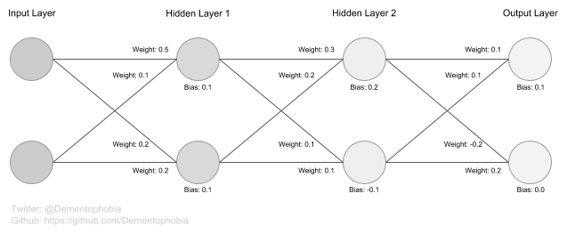
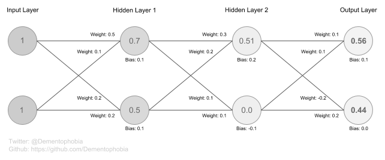

# Implementing a manual forward-pass in a fully connected artificial neural network

This article shows, how a forward-pass can be performed *manually* without framework support in a simple artificial neural network (ANN). The primary goal of this article is to show how simple ANNs are internally. Especially in times when mass media is hyping certain achievements in the field of AI, it is important to keep in touch with the fundamentals and remind ourselves, what's actually beneath the surface. Those achievements are impressive, but the low-level implementations are far from being voodoo magic.

## Why would you implement a forward-pass yourself?

For science! Seriously, there is no reason to implement your own forward-pass when you are already using a framework for artificial neural networks. I chose the Keras implementation of Tensorflow for my example, which actually provides everything you need to build a simple ANN without getting into any low-level details. So please do not use this code in production, it is just meant for education.

I discuss the code below, but you can get the [full script here](forward-pass.py) to try it for yourself.

## What is a forward pass?

Every time you give your ANN input and let it calculate the corresponding output, you are performing a so called forward pass. The example I implemented was inspired by a great article from Andrey Sakryukin titled [Under The Hood of Neural Networks - Part 1: Fully Connected](https://towardsdatascience.com/under-the-hood-of-neural-networks-part-1-fully-connected-5223b7f78528). He explains the forward-pass very well in his article and I highly recommend you to have a look at it. I am using the same ANN that he describes in his article as example here as well.

## Building the model

The model is built using [Tensorflow](https://www.tensorflow.org/) as well as the [Keras implementation of Tensorflow](https://www.tensorflow.org/guide/keras):

```
import tensorflow as tf
from tensorflow import keras
import numpy as np
```

The idea of this simple model is an ANN with an input layer, two fully connected hidden layers and an output layer. Each layer has two neurons. The two hidden layers use [ReLU](https://ml-cheatsheet.readthedocs.io/en/latest/activation_functions.html#relu) as an activation function, while the last layer uses [Softmax](https://ml-cheatsheet.readthedocs.io/en/latest/activation_functions.html#softmax).

```
model = keras.Sequential([
    keras.layers.Dense(2, input_shape=(2,), activation=tf.nn.relu),
    keras.layers.Dense(2, activation=tf.nn.relu),
    keras.layers.Dense(2, activation=tf.nn.softmax)
])
```

To simplify the example, rounded values are used for the weights and biases of all the neurons. It is rather unusual to set the weights and biases of an ANN manually, but it is an interesting exercise to show how easy it is. The Layers used in a Keras Model provide the function `set_weights()`, allowing us to pass the values directly as numpy arrays.

Note: The values are chosen to reflect the ANN of the previously referenced article.

```
weights_layer = [[np.array([[0.5, 0.2],  [0.1, 0.2]]),
                  np.array([0.1, 0.1])],
                 [np.array([[0.3, -0.1], [0.2, 0.1]]),
                  np.array([0.2, -0.1])],
                 [np.array([[0.1, -0.2], [0.1, 0.2]]),
                  np.array([0.1, 0.])]]

for layer in range(3):
    model.layers[layer].set_weights(weights_layer[layer])
```

Of course we can also access those values at any time when working with the model. This will be useful for debugging and also for visualisation of the inner workings of an ANN. The function `get_weights()` shows us all the weights and biases of a given layer.

```
for i in range(3):
    print(model.layers[i].get_weights())
```

The result shows, that we get a list with two arrays for each layer. The first array contains the weights and the second array contains the biases.
```
[array([[0.5, 0.2],
       [0.1, 0.2]], dtype=float32), array([0.1, 0.1], dtype=float32)]
[array([[ 0.3, -0.1],
       [ 0.2,  0.1]], dtype=float32), array([ 0.2, -0.1], dtype=float32)]
[array([[ 0.1, -0.2],
       [ 0.1,  0.2]], dtype=float32), array([0.1, 0. ], dtype=float32)]
```

But since a picture says more than a thousand arrays, here is what our minimal ANN looks like:



In the end we need to compile the model, because we want to use the inbuilt function `predict()` to compare the results of the framework with our manually calculated result. As we are only concerned with the forward pass in our example and do not do any back propagation, we can actually choose a random optimizer and loss function as they are not used for the forward pass anyway.

```
model.compile(optimizer='adam', loss='categorical_crossentropy')
```

## Performing the forward pass without framework support

Once we have built our model, we can calculate a forward pass. Again, we are using the input from the referenced article, setting both input parameters to 1 (`input = np.array([np.array([1., 1.])])`).

First we need a representation of the values of all the layers we are working with. The first layer (input layer) is defined by the input, the three dense layers of the model are initialized with zero-values. I chose a 2D numpy array for this purpose.

```
values = np.zeros([2, 4])
values[:, 0] = input
```

Now we are ready for the forward pass. All we need to do is updating each layer from left to right (`for layer in range(3):`). As all layers have the same size, we can conveniently iterate over the hardcoded size of two neurons for each layer (`for i in range(2):`), but this could of course be implemented dynamic as well to support other architectures. Because we are working with a fully connected architecture, all values of the neurons of the previous layer (`for i_prev_layer in range(2):`) affect the value of all values in the current layer.

We update the value by adding the product of the respective values with the respective weights together, followed by adding the bias once afterwards. For the layers with ReLU as the activation function, we apply ReLU for each neuron individually. For the layers with Softmax as the activation function, we apply Softmax after the values of all neurons are set, because Softmax takes all values into account.

In the end we return a numpy array of the last layer to mimic the behavior of the function `predict()`, which is built into the framework.

```
for layer in range(3):
    for i in range(2):
        for i_prev_layer in range(2):
            weight = model.layers[layer].get_weights()[0][i_prev_layer][i]
            prev_value = values[i_prev_layer][layer]
            values[i][layer+1] += prev_value * weight
            
        bias = model.layers[layer].get_weights()[1][i]
        values[i][layer+1] += bias
           
        if model.layers[layer].get_config()["activation"] == "relu":
            values[i][layer+1] = relu(values[i][layer+1])
               
    if model.layers[layer].get_config()["activation"] == "softmax":
        values[:, layer+1] = softmax(values[:, layer+1])

return np.array([values[:,-1]])
```

The functions ReLU und Softmax have been implemented in the same script.

```
def relu(value):
    return(max(0., value))

def softmax(values):
    return np.exp(values) / np.sum(np.exp(values))
```

Now we can compare the results of the built-in forward pass using `predict()` to our own `forward_pass()`.

```
print("\nValues calculated by the framework with the function 'predict':")
print(values_from_framework)
print("\nValues calculated by the self-made function 'forward_pass':")
print(values_from_function)
```

Looks like we have been successful:

```
Values calculated by the framework with the function 'predict':
[[0.56 0.44]]

Values calculated by the self-made function 'forward_pass':
[[0.56 0.44]]
```

What the actual calculations look like internally, can be seen in the following output. Please note that the values are the values **after** the activation function has been used.

```
All the values of the layers created during the forward pass:

[[1.   0.7  0.51 0.56]
 [1.   0.5  0.   0.44]]
```

We can fill in those numbers in our graph to see even clearer what's happening during the forward pass.



## Conclusion

This shows that we are capable to let an ANN run without any of the functions provided by the framework using basic algorithms and mathematics. Training them with back propagation is a different kind of game, requiring more advanced mathematics, but in the end the complexity of the algorithms isn't that much greater.

Of course, we chose the simplest kind of ANN for this demonstration and with a more complex network architecture things get a bit trickier. But every time we are in awe when we see what such an ANN can accomplish, we should take a second to consider, that below the surface it's just a series of simple operations with carefully trained values that keeps the engine running.
