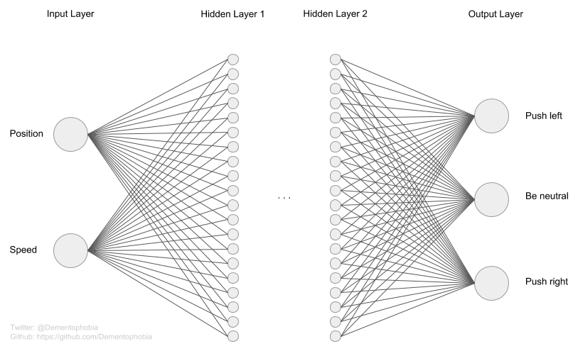
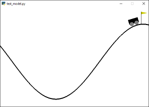
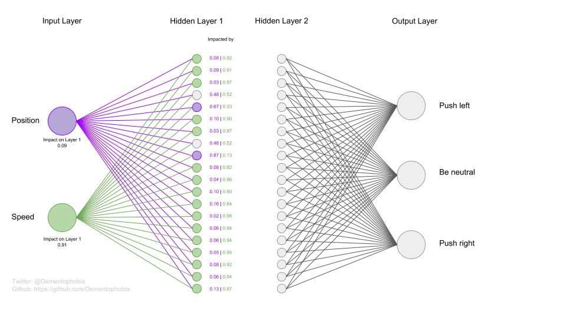
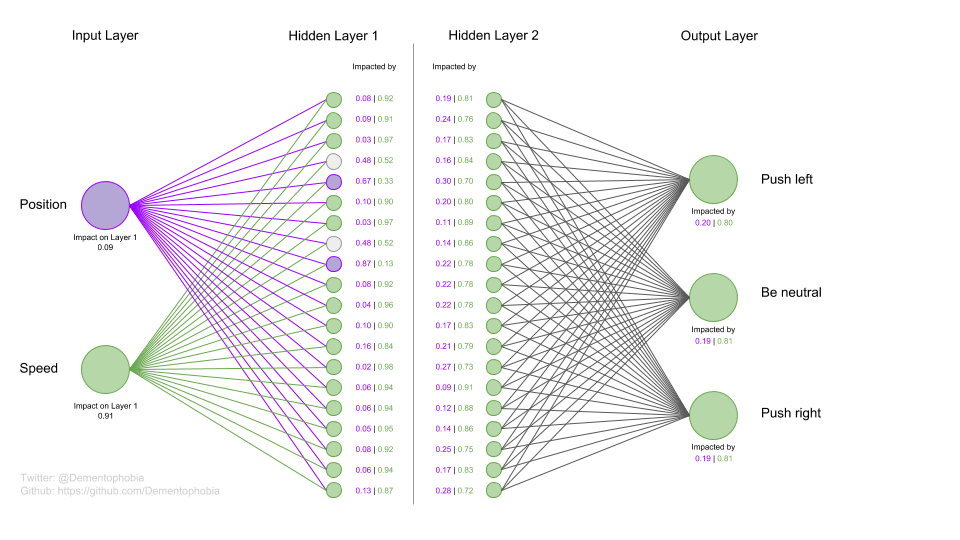
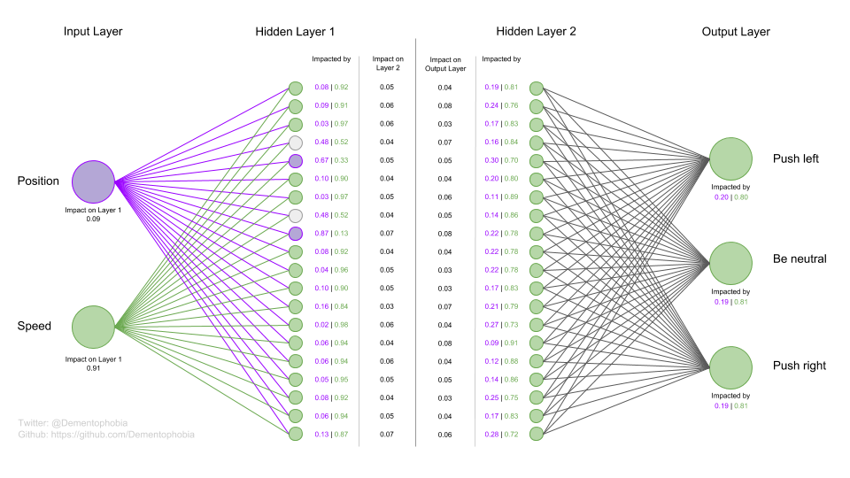

# Analyzing how artificial neural networks shield against environmental noise (part 1)

In this article I am analyzing how a dense artificial neural network (ANN) treats input parameters, that have no or only a minor influence on the decision the ANN is supposed to make. Such input parameters can be considered noise in the input parameter space and ANNs should be able to deploy mechanisms to shield against them.

I will use a well known environment from Open AI, train models to solve it and use the Python tools I designed to analyze how the models behave in respect to the input parameter, that can safely be ignored. In addition, I will show how you trace the impact of the different input parameters throughout the network. All Python scripts are provided so that you can play around with the networks yourself and get to know the underlying mechanics even better.

## Setting up the experiment

Instead of creating an overly simplified example for my experiments manually, I decided to use one of the classic environments provided by the [Open AI gym](https://gym.openai.com/), called [MountainCar-v0](https://gym.openai.com/envs/MountainCar-v0/). If you want to try the provided Python scripts yourself, you have to [install](https://gym.openai.com/docs/#installation) the Open AI gym first. As soon as the ANNs get involved, you will also require [Tensorflow](https://www.tensorflow.org/) (all scripts tested with 1.12.0) and [Numpy](http://www.numpy.org/) (all scripts tested with 1.16.2). I recommend using [Anaconda](https://www.anaconda.com/) or [Miniconda](https://docs.conda.io/en/latest/miniconda.html) to manage your Python environments and install scientific packages. Every script provided was tested with Python 3.6.

The MountainCar environment is simple enough for our needs and has the required properties, as we will see in the following analysis.

### Analyzing the environment

The environment is described well on the [Open AI website](https://gym.openai.com/envs/MountainCar-v0/):

> A car is on a one-dimensional track, positioned between two "mountains". The goal is to drive up the mountain on the right; however, the car's engine is not strong enough to scale the mountain in a single pass. Therefore, the only way to succeed is to drive back and forth to build up momentum.

The challenge is intended to be solved by some form of AI, without restricting the methods that can be used. Typical approaches are Q-learning or Deep Q-learning but you can experiment with whatever approach you like.

To see if this environment is suitable for our experiments, we have to find out, if there are any input parameters, that can be neglected for the solution and can therefore be considered irrelevant. Therefore, we do not use an learning algorithm in this first step but try to solve the challenge manually with the  Python script [solve_manually.py](solve_manually.py).

The environment provides us with the following input parameters, called observation space:

```python
env = gym.make("MountainCar-v0")
print(env.observation_space.high)
print(env.observation_space.low)

[-1.2  -0.07]
[0.6  0.07]
```

All we (and an ANN, that wants to solve this challenge) know, is that there are two parameters defining the state of the environment. The first one ranges from -1.2 to 0.6 and the second one ranges from -0.07 to 0.07. By looking at the source code of the environment or just by playing around with the running environment a little, we can quickly find out that the first parameter is the position of the car and the second parameter is the speed of the car. If the speed is negative, it moves to the left, if it is positive, it moves to the right.

There is also a limited set of actions that we can use to interact with the environment:

```python
print(env.action_space)

Discrete(3)
```

`Discrete(3)` means that we can provide three different actions: 0, 1 or 2. Again, we can either look at the source code of the environment or just play around with the running environment to identify the effect of those three actions:

* 0 ... Push car to the left
* 1 ... Do nothing
* 2 ... Push car to the right

Now we have all the information we need to solve the challenge "manually".

### Solving the environment the easy way

We already know from the description of the environment, that we will have to gain extra momentum by driving up the hill on the left, which enables us to reach the target on the right. If we ignore for now that we only need to drive up the left hill for a certain amount to get to the perfect solution, the easiest algorithm that comes to mind is the following:

```python
def act(state):
	speed = state[1]
	
	if speed < 0:
		return 0  # Push car to the left
	elif speed > 0:
		return 2  # Push car to the right
	
	return 1  # Do not push
```

If the speed is negative (we are going left), keep pushing left until we run out of steam. At this point the speed gets down to zero and the cart rolls back down the hill, gaining a positive speed value. If the speed is positive (we are going right), keep pushing right until we run out of steam. As you can see, we totally ignore the current position of the car. While this does not allow us to solve the challenge in the minimum amount of time for a given situation, it at least allows us to solve it consistently every time with a very easy approach.

If you want to try it yourself, you can run the provided script [solve_manually.py](solve_manually.py) without parameters `python solve_manually.py`.

### Assumption

Ignoring the potential for optimization, we have seen that the problem can be solved by using only one of the two input parameters provided by the environment. Therefore, it would be a reasonable assumption, that a trained ANN will most likely focus on the more important input parameter **speed** and almost ignore the less relevant parameter **position**, treating it like noise. In practice, this can be seen by weak connections between the less relevant input parameter and the rest of the network.

To test this assumption, we will train several ANNs through Deep Q-learning and take a look at the weights to see if we can actually witness this effect in practice.

## The ANN factory

To create different ANNs that can solve the mountain car challenge, I've built a factory that trains randomly initialized ANNs until the model manges to finish the challenge with less than 200 steps at least five times in a row. If they cannot do this within 10.000 learning steps, they are discarded and a new model is trained. The successful models are saved for further analysis in the next step.

The factory is ready to use and you can train your own ANNs with the script [ann_factory.py](ann_factory.py). Just run the script without parameters `python ann_factory.py`. Be careful if you have already trained some models previously, as the factory will start overwriting your existing models if you don't rename them or move them to a secure location. The factory is designed as a proof-of-concept and has to be handled with car.

Please be aware that this factory is far from being optimized and it took me several hours to get ten suitable models that could solve the challenge well enough to meet the requirements. It uses a simple Deep Q-learning algorithm and more often than not the models do not converge. Because I only needed a handful of sample models and was not concerned with learning speed or optimization, this simple factory was good enough for the job - again, treat it as the proof-of-concept that it is. I might refactor and improve it one day, but don't hold your breath.

You'll see in the code that I've built my own reward function, based on the distance the car has made it up the hill, to speed up the learning process. It's a dirty little hack, but it worked wonders to speed up the process:

`reward = max(reward, next_state[0])`

The reward of the environment itself would only be given when the challenge is solved. To solve it without the hack, a lot more trial and error would be required for the ANN to find the first solutions to built upon.

### The architecture of the models

I decided to go with a very simple architecture, that seems appropriate for the challenge but can still be illustrated well in detail. The models consist of two dense hidden layers and of course an input and an output layer as defined by the environment we chose.

```python
model = keras.Sequential([
    keras.layers.Dense(20, input_shape=(2,), activation="relu"),
    keras.layers.Dense(20, activation="relu"),
    keras.layers.Dense(3,  activation="linear")
])
model.compile(loss="mse", optimizer="Adam")
```

Below you see what the network looks like. I skipped the 400 connections between hidden layer 1 and hidden layer 2, but rest assured, those are densely connected.



## Examining the specimen

Now that we have ten samples of models that can solve the mountain car challenge reasonable well, we can check if our assumption holds true. I provided those models as reference, you'll find them in the repository named `trained_model_ID.h5`, with ID ranging from 0 to 9. If you want to actually see the models in action, you can run them with the script  [test_model.py](test_model.py) by running `python test_model.py ID`, where ID is the number of your model (e.g. `python test_model.py 0`). It's quite fun to see how different some of their learned strategies are, so don't miss checking out all of them!



Checking our assumption can easily be done by looking at the weights of the network. You can try this for the provided models or even your own models using the script [examine_model.py](examine_model.py) by running `python examine_model.py ID`, where ID is the number of your model. I want to examine the first model `trained_model_0.h5`, so I run `python examine_model.py 0`.

### Looking at the initial impact of the input parameters

At first, we are interested in the neurons directly connected to our input parameters. The function `input_impact(model)` shows us the following information:

```
Weights of neurons connected to the 'position' input:
[-0.47 -0.55 -0.18  0.71  0.61 -0.59 -0.18  0.11  0.53 -0.5
 -0.26 -0.53 -0.01 -0.08  0.02 -0.37 -0.32 -0.51 -0.31 -0.67]

Weights of neurons connected to the 'speed' input:
[-5.7  -5.41 -5.47  0.78 -0.3  -5.31 -5.17  0.12 -0.08 -5.45
 -5.72 -4.99  0.06 -5.06 -0.34 -5.78 -5.78 -5.75 -5.08  4.41]
```

As we can already see, all of the weights of the neurons connected to the *position* input - which we assumed is less relevant for the problem - is in between -1 and 1. The weights of most of the neurons connected to the *speed* input on the other hand have significantly higher or lower values. Since the impact of a neuron is based on the absolute value of the weight, we can already see that the speed influences the result way more. An easy way to calculate the impact of an individual input parameter, is summing up the absolute weights of the attached neurons. I decided to divide this value by the sum of all impacts of all neurons on this layer for normalization, in case we want to compare models with a different architecture. Another benefit of the normalization is, that the impact will always sum up to 1. This will also hold true for ANNs with more than two input parameters.

```
Normalized sum of absolute weights (impact) of neurons connected to the 'position' input:
0.09

Normalized sum of absolute weights (impact) of neurons connected to the 'speed' input:
0.91
```

For this specific model we can see that **the position input is almost neglected** while **the speed input influences the network significantly**. The same holds true for the other nine specimen that I have trained, although the actual values do differ slightly of course.

If you want to see how easy this can be done in Tensorflow with Keras, here is the relevant excerpt from my Python script [examine_model.py](examine_model.py).

```python
weights_pos   = model.layers[0].get_weights()[0][0]
weights_speed = model.layers[0].get_weights()[0][1]

impact_pos   = sum([abs(weight) for weight in weights_pos])
impact_speed = sum([abs(weight) for weight in weights_speed])

sum_of_impact = impact_pos + impact_speed

impact_pos   /= sum_of_impact
impact_speed /= sum_of_impact
```

### How is each neuron on the first layer impacted?

We have seen above, that we can calculate the impact of each input parameter on the first layer of the network. But if we want to analyze how this impact propagates further throughout the network, we need to know how each neuron is impacted specifically.

I wrote the function `impacted_by(model, layer, input_id)` to solve this question. It is already designed to analyze all layers in the network recursively, but for now we will stick to the first layer by calling the function as follows in the Python script `examine_model.py`.

```
impacted_by(model, 1, 0)

Each neuron on layer 1 gets impacted by the selected input parameter 0 'Param' and all the other input parameters 'Other' propagated through the network as follows:

Neuron  Param   Other
1       0.08    0.92
2       0.09    0.91
3       0.03    0.97
[... SNIP ...]
18      0.08    0.92
19      0.06    0.94
20      0.13    0.87
AVG:    0.18    0.82
```

The impact propagation is calculated by tracing the impact from the input layer through the network. On the first layer this is pretty easy, as the selected parameter (in this case 0, the position input) is only affected by the parameter itself, so we can consider its influence absolute. On the later layers it becomes more interesting, as a neuron on a previous layer, that is affected let's say 50:50 by the selected parameter and the other parameters, will only propagate 50% of the impact of the selected parameter and 50% of the impact of the other parameters to the attached neurons. 50:50 here is just an easy example. As we can see, the impact is distributed over a broad range of values.

To calculate the impact on a specific neuron, we take the sum of the relevant impact of all source neurons multiplied by the weight of the respective neuron. The result is divided by the sum of the full impact of all input parameters to achieve normalization. If you want to dig deeper, I recommend checking out the function `impacted_by(model, layer, input_id)` in the script [examine_model.py](examine_model.py).

Now we can update our architecture overview with the information we have learned so far. To illustrate the impact flowing through the network, I colored the neurons mostly impacted (above 66%) by the parameter *position* purple and the neurons mostly impacted (above 66%) by the parameter *speed* green.



We can see, how much the network is shielded against the *position* parameter by the first layer. Only two neurons are impacted more than 66% by the *position* parameter while sixteen neurons are impacted more than 66% by the *speed* parameter.

### Propagating the impact throughout the network

The function used to analyze the first layer is already designed to recursively analyze the whole network. We just have to specify the last layer - layer 3, the output layer - and we get all the values we are interested in.

```
impacted_by(model, 3, 0)

[... SNIP ...]
Each neuron on layer 2 gets impacted by the selected input parameter 0 'Param' and all the other input parameters 'Other' propagated through the network as follows:

Neuron  Param   Other
1       0.19    0.81
2       0.24    0.76
[... SNIP ...]
19      0.17    0.83
20      0.28    0.72
AVG:    0.19    0.81

------------------------------------------------------------------------------

Each neuron on layer 3 gets impacted by the selected input parameter 0 'Param' and all the other input parameters 'Other' propagated through the network as follows:

Neuron  Param   Other
1       0.20    0.80
2       0.19    0.81
3       0.19    0.81
AVG:    0.19    0.81
```

I shortened the output for brevity, but will update our overview with the values learned in the image below. What stands out to me is the fact, that there is no more shielding effect visible on the layers after the first one. The average impact of the parameters (~19% for the *position* parameter) stays constant. We will look a little deeper into this, but first here is the updated overview.



Once we reach Layer 2, all neurons are dominated by the *speed* parameter. Still, as mentioned above, the average impact stays almost constant after Layer 1, it just gets more evenly distributed.

*Please note, that this method does not take the bias into account at all. I assume that the influence of the bias can be neglected  most of the time, but additional experiments would be necessary to verify this assumption.*

### An afterthought - impact of specific neurons within the network

Looking at the overview in the last chapter, I became curious about the specific impact of the two purple neurons on Layer 1. I expected some kind of additional shielding effect against those neurons. The data gathered so far does not support such an assumption, so I wanted to dig deeper.

I wrote the function `layer_impact(model, layer, verbose=False)`, which can also be found in the script `examine_model.py`. It calculates the impact of each neuron within the network, similar to what we have already done with the input parameters and their impact on the first layer. Let's see what we can find out and update our overview one last time.

```
layer_impact(model, 1)
layer_impact(model, 2)

------------------------------------------------------------------------------

Impact of neurons on layer 1 connected to neurons on layer 2:

Neuron  Impact
1       0.05
2       0.06
[... SNIP ...]
19      0.05
20      0.07

------------------------------------------------------------------------------

Impact of neurons on layer 2 connected to neurons on layer 3:

Neuron  Impact
1       0.04
2       0.08
[... SNIP ...]
19      0.04
20      0.06
```

Again, snipped for brevity. Let's use the insight to make our last update.



The inclusion of the impact analysis of specific neurons showed what we already suspected. There is no shielding effect against the two purple neurons on Layer 1. With an impact of 0.07 the second purple neuron even ties for most impact with only one other neuron.

## Conclusion

During our experiments we validated our assumption, that **neurons attached to input parameter that are less relevant for the given problem, are weak**. Their weights settle around zero, thereby **shielding the rest of the network against the irrelevant input**, which can be considered mostly as noise. It is interesting, that this shielding effect can only be witnessed on the first layer of the network.

While this behavior is interesting in itself, it also provides an **useful method for analyzing environments**. By calculating the impact of the input parameters on a well trained neural network, we can determine how much influence the individual input parameters have on the outcome of the decision we want to make. This can lead to valuable insights into the importance of parameters we consider analyzing in a specific environment.

In our specific environment, when we think back to where we started, we were able to deduce via experiments, that the *position* parameter is less relevant. In a more complex environment, this might be hard to almost impossible. Applying what we have learned in this article, we could do it the other way round by training an ANN and analyzing it to see how much each input affects the decision making. Of course this only work if the ANN is well trained and delivers good results. How prominent this effect is in more complex environments has to be evaluated. This can be the next step of research, building upon the article at hand.

### Addressing the elephant in the room

I mentioned during the analysis of the environment, that the *position* isn't completely irrelevant, but at least a very good solution can be found without considering the *position*. Of course, our ANN doesn't know this and utilizing the *position* can help to grind out even better performance in some environment states. The *position* leakage we witnessed in our analysis might therefore not be a weakness of the ANN but actually a strength, as the network might have learned to incorporate the *position* to some degree to improve it's performance. I decided to dig deeper into this issue in [part 2](../how-ann-shield-against-environmental-noise-part-2/README.md), as this would go beyond the intended scope of this article.