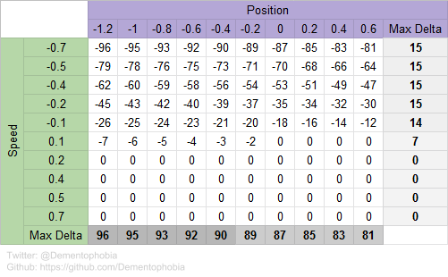

# Analyzing how artificial neural networks shield against environmental noise (part 2)

We have seen in [part 1](../how-ann-shield-against-environmental-noise-part-1/README.md), how an artificial neural network (ANN) shields against less relevant input parameters. We performed experiments on actual working models to see how the impact of such an input parameter is distributed across the network and to which degree it influences the output of the network.

The chosen example only consisted of two input parameters, to make analysis as straight forward as possible. But the less relevant input wasn't pure noise, it still could be used for minor optimization by the model. And that's exactly what we saw in the results - the less relevant parameter still had some influence on the output.

The methods used were not out of the books but rather homebrew algorithms. And while the results felt intuitively correct, I didn't feel at ease when I finished part 1 because it lacked some kind of verification. That's were part 2 comes into play. In this follow-up article, I want to analyze, how much impact the two input parameters really do have across the full spectrum of possible environments. I will choose a totally different approach this time, and if the results correlate, it will give me more confidence in my prior results.

## The test setup

We will use the same environment and models that already served us in [part 1](../how-ann-shield-against-environmental-noise-part-1/README.md). Of course you can use any of the ten models we generated last time as well as your own trained models to perform the experiments I lay out in this article. Please note that all models have the same architecture but different weights and biases, therefore you will see slightly different results depending on the model you choose. If you want to see the same numbers that I am working with, you'll have to use [Model 0](trained_model_0.h5).

All the code used in this article is assembled in the script [examine_combinations.py](examine_combinations.py).

### Let's run a simple test

As we have seen, the environment has certain limits concerning the two input parameters. The 
*position* parameter ranges from -1.2 to 0.6 and the *speed* parameter ranges from -0.07 to 0.07. We can now use our model to calculate actions for the different combinations of the input parameters and see how the model would decide. Since we are dealing with float values, we have to choose a sensible sampling rate. Let's use 10 samples per input parameter, resulting in 100 calculations in total.

```python
def print_output_matrix_after_activation(model, samples=10):
    results = np.zeros((samples, samples), dtype=int)

    for speed in range(samples):
        for position in range(samples):
            p = -1.2 + position * (0.6 + 1.2) / (samples - 1)
            s = -0.7 + speed    * (0.7 + 0.7) / (samples - 1)
            results[speed][position] = act(model, np.array((p, s)))

    print(results)

[[0 0 0 0 0 0 0 0 0 0]
 [0 0 0 0 0 0 0 0 0 0]
 [0 0 0 0 0 0 0 0 0 0]
 [0 0 0 0 0 0 0 0 1 1]
 [0 0 0 0 0 1 1 1 1 1]
 [2 2 2 2 2 2 1 1 1 1]
 [2 2 2 2 2 2 2 2 1 1]
 [2 2 2 2 2 2 2 2 2 2]
 [2 2 2 2 2 2 2 2 2 2]
 [2 2 2 2 2 2 2 2 2 2]]
```

Putting the results into a spreadsheet shows us, what the model is actually doing:


We can see that it almost behaves like our [hand crafted solution](../how-ann-shield-against-environmental-noise-part-1/README.md#solving-the-environment-the-easy-way) in part 1. If the speed is negative, it pushes to the left, and if the speed is positive, it pushes to the right. The only exception to this rule happens when the car already gets closed to the goal and the speed is slow (between -0.2 and +0.2). In this case, the model decides to stop pushing and goes idle, until the cart gains additional speed while going down the hill again.

What does this mean for our analysis? In part 1 we came to the conclusion, that *position* does have an effect, but only a small one, while *speed* is the dominant factor for our model. Does this match the table above?

It actually does. If we take any arbitrary *position* - without knowing the *speed* - we can only guess which action the model will take. If the car is more to the left, it could either be 0 or 2, of the car is more to the right, it could be 0, 1 and 2. We have no way of knowing what will happen, without looking at the *speed*. And if we decide to guess, we have a 50% chance to be right at best, for some *positions* even worse.

On the flip side, there is quite a significant range of *speeds*, where we don't need to know the *position* at all. At *speeds* at or below -0.4 and *speeds* at or above +0.4 there is only one specific action the model will take, basically ignoring the position parameter. Only in the mid range, around *speed* 0, we have to guess. And even there, at most *speed* values we a have a better than 50% chance to get it right.

Therefore we can conclude, that the *speed* has significantly more impact on the decision than the *position*.

### Looking at the output before applying the activation function

So far, so good, but what we have seen above is only the first part of the puzzle. It seems like we are on the right track, but we only looked on the final output - the decision - of the network.

The output layer uses the linear activation function, before it tells us the result. This means that the model doesn't care by how far the best action is winning - it simply takes the action with the highest value and doesn't tell us how it came to this final decision. This acts as a form of filter for the results of our experiments and we should at least take a peak behind it, before coming to our conclusion.

But how do we get this information? Do we have to train a new model without the final activation function to get those values? Luckily, Keras lets us upgrade our model and we can do this with [a few lines of code](https://keras.io/getting-started/faq/#how-can-i-obtain-the-output-of-an-intermediate-layer). The only thing we need to figure out first, is the internal name of the layer we want to access. We can use `model.summary()` to get this information. For our model, we get the following result:

```
Layer (type)                 Output Shape              Param #
=================================================================
dense_9 (Dense)              (None, 20)                60
_________________________________________________________________
dense_10 (Dense)             (None, 20)                420
_________________________________________________________________
dense_11 (Dense)             (None, 3)                 63
=================================================================
Total params: 543
Trainable params: 543
Non-trainable params: 0
```

We are interested in the values of our last layer called `dense_11`, which can be accessed as follows:

```
layer_name = 'dense_11'
inspect_model = keras.Model(inputs=model.input,
                            outputs=model.get_layer(layer_name).output)
inspect_output = inspect_model.predict(shape_state(np.array((input_1, input_2))))
```

Please note that this time we are not comparing the final decisions against each other, but the values of each output neuron before the activation function. Because we have three output neurons, we have three matrixes that we can analyze. We will only work with the output neuron 0 in this article, since the other two neurons almost behave identically. Feel free to use the [provided script](examine_combinations.py) to check for yourself.

```python
def print_output_matrix_before_activation(model, output, samples=10):
    layer_name = 'dense_11'
    inspect_model = keras.Model(inputs=model.input,
                                outputs=model.get_layer(layer_name).output)

    results = np.zeros((samples, samples), dtype=int)

    for speed in range(samples):
        for position in range(samples):
            p = -1.2 + position * (0.6 + 1.2) / (samples - 1)
            s = -0.7 + speed    * (0.7 + 0.7) / (samples - 1)
            results[speed][position] = inspect_act(model, np.array((p, s)), output)

    print(results)

[[-96 -95 -93 -92 -90 -89 -87 -85 -83 -81]
 [-79 -78 -76 -75 -73 -71 -70 -68 -66 -64]
 [-62 -60 -59 -58 -56 -54 -53 -51 -49 -47]
 [-45 -43 -42 -40 -39 -37 -35 -34 -32 -30]
 [-26 -25 -24 -23 -21 -20 -18 -16 -14 -12]
 [ -7  -6  -5  -4  -3  -2   0   0   0   0]
 [  0   0   0   0   0   0   0   0   0   0]
 [  0   0   0   0   0   0   0   0   0   0]
 [  0   0   0   0   0   0   0   0   0   0]
 [  0   0   0   0   0   0   0   0   0   0]]

[... SNIP ...]
```

As you can see, the values look quite different compared to the last matrix we analyzed. That's because the last matrix showed us the actual decision of the model (a classification displayed by the arbitrary chosen values 0, 1 and 2) for the given inputs, while the matrix at hand shows us the estimated value the network expects to get when performing the associated action based on the given input. In our case - we are looking at output neuron 0 - this would be the expected long-time reward for pushing left in the different states.

For the sake of completeness and a better understanding, here are the values for neuron 1 and neuron 2 as well:

```
[[-97 -96 -94 -93 -91 -89 -87 -86 -84 -82]
 [-80 -78 -77 -75 -74 -72 -70 -68 -67 -65]
 [-62 -61 -59 -58 -56 -55 -53 -51 -49 -47]
 [-45 -44 -42 -41 -39 -37 -36 -34 -32 -30]
 [-26 -25 -24 -23 -21 -20 -18 -16 -14 -12]
 [ -8  -6  -5  -4  -3  -2   0   0   0   0]
 [  0   0   0   0   0   0   0   0   0   0]
 [  0   0   0   0   0   0   0   0   0   0]
 [  0   0   0   0   0   0   0   0   0   0]
 [  0   0   0   0   0   0   0   0   0   0]]

[[-98 -97 -95 -94 -93 -91 -89 -88 -86 -85]
 [-81 -79 -78 -76 -75 -73 -72 -70 -69 -67]
 [-63 -62 -60 -59 -57 -56 -54 -53 -51 -49]
 [-46 -44 -43 -41 -40 -38 -37 -35 -33 -32]
 [-26 -25 -24 -23 -22 -21 -19 -17 -16 -14]
 [ -7  -6  -4  -3  -2  -1  -1   0   0   0]
 [  0   0   0   0   0   0   0   0   0   0]
 [  0   0   0   0   0   0   0   0   0   0]
 [  1   1   1   0   0   0   0   0   0   0]
 [  1   1   1   1   1   1   1   1   1   0]]
```

The actual differences are only very small between the three neurons for a specific input. On the top left (speed = -0.7 and position = -1.2) the expected reward for pushing left is -96, for doing nothing it is -97 and for pushing right it is -98. Therefore, the model would decide the push left (action 0), because -96 is the highest value of all available options. Let's check with the table from the previous chapter above - Bingo!

It is not surprising that the values are so close together, but explaining this in detail would dive to deep into deep reinforcement learning and would derail us too much right now. Therefore, I've decided to leave this open for your own analysis.

Back to neuron 0. Let's look at the table below to see how big the impact of the input parameters *speed* and *position* is on our neuron of choice:



I added a column and a row for the maximum delta. Because we are not working with the decision of the model (which is a classification) but the actual values from the output layer, it makes sense to analyze the values themselves. The value for **max delta** is simply the difference between the smallest and the largest values in the respective row / column.

Now we can ask the same question we did in the previous chapter. How easy would it be to guess the value of the output neuron 0, if we only know the input parameter *speed*? Looking at the table and the calculated max delta, we can be confident to guess closely to the correct value. If the speed is at 0.2 or above, we will always guess correct, because 0 is the only possible answer. And if the value for speed drops below, the range of possible values isn't very spread out either (max delta around 15), so we still have a good idea, which value the model will predict approximately.

On the other hand, if we only know the *position*, we are facing a much harder problem. No matter what's the value of *position*, in the best case we are dealing with a range of 81. In the worst case, the range goes up to 96. Our guesses will be significantly worse on average compared to the previous scenario.

This analysis strengthens our initial assumption. Not only is the actual decision of the model much more dependent on the input parameter *speed* compared to the input parameter *position*, the values of the output neurons before activation show exactly the same behavior.

## Conclusion and Further Reading

We have analyzed how artificial neural networks deal with input parameters that are not that relevant for the decision at hand compared to other input parameters, using different approaches in part 1 and part 2 of this series. We have seen how the network shields against this type of noise and what happens below the surface of the neural network.

The models we chose were simple on purpose, but the same types of analysis can of course be done on larger and more complex neural networks as well.

Our analysis was focused on getting deep inside the inner workings of the neural network for educational purposes. In practice, we will use more standardized approaches to analyze the importance of input parameters, for example when we perform input pruning. There are many great papers available on this topic - just google `input pruning` and you shall find.

Last but not least, Kaggle released an amazing [Micro-Course on Machine Learning Explainability](https://www.kaggle.com/learn/machine-learning-explainability), covering methods for the analysis of [Permutation Importance](https://www.kaggle.com/dansbecker/permutation-importance). I highly recommend working through this course, as it also inspired some ideas for the article at hand. Keep on learning and enjoy the process!