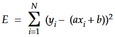
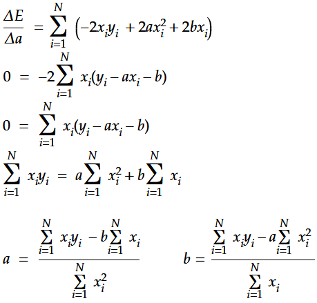
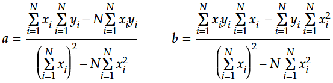
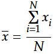

# Regression Analysis - Part 1: Simple Linear Regression

Let's face it - up to here we were dodging most of the important math involved when dealing with artificial neural networks. But when we really want to understand what makes a neural network tick, we have to work through those aspects as well.

The first step on our journey is simple linear regression - if you are like me and do not have a solid background in statistics, this is already a challenge. But if you are willing to put in some extra hours, you'll be able to master simple linear regression nevertheless.

In this article I go through the necessary steps to derive the basic formulas for simple linear regression and show you how to implement a function in Python utilizing what we have learned to calculate the line of best fit for arbitrary data sets. The code that I created for this article is available in the file [simple_linear_regression.py](./simple_linear_regression.py).

Throughout this article I will reference many of the sources I used to study linear regression myself. They provide additional information as I try to keep it brief and simple. My most noteworthy source is the [Udemy course about Linear Regression](https://www.udemy.com/data-science-linear-regression-in-python/) created by Lazy Programmer. If you are serious about studying artificial neural networks and are willing to invest some bucks into high quality tutorials, check out [his full series about deep learning](https://deeplearningcourses.com/course_order). You won't be disappointed!

Another shout-out goes to [Mathcha.io](https://www.mathcha.io/). All math formulas in this article have been created with this free online tool. Sure, you can always fall back to LaTeX, but Mathcha.io proved to be a quick and easy solution for me to play around with equations and take notes.

## What is Simple Linear Regression?

If you are totally new to the topic, the article at hand is a good first introduction to simple linear regression. For further reading I suggest the comprehensive entry from Wikipedia about [linear regression](https://en.wikipedia.org/wiki/Linear_regression) or the more specific entry about [simple linear regression](https://en.wikipedia.org/wiki/Simple_linear_regression).

The main idea behind simple linear regression is to find the line of best fit in a 2D scatterplot with one independent variable. This means we need such a scatterplot for our analysis. Let's make up a fake study about the correlation between the outside temperature and the average consumption of water per day per person.

## The Fake Water Consumption Study

The result of our made up study might look something like the following chart. Please note that the data points are randomly generated and if you play around with the provided script yourself, you will get different data points each time you run the script.


While it is not important for our study, how this data was generated, you might still be curious, so here is the relevant source code in Python. And if you have never worked with the function ```np.random.multivariate_normal()``` before, you can check out the [SciPy documentation](https://docs.scipy.org/doc/numpy/reference/generated/numpy.random.multivariate_normal.html).

```python
def generate_water_stats():
    cov  = np.array([[1.2, 1], [1, 1]])
    mean = np.array([3.2, 3.5])

    values = np.random.multivariate_normal(mean=mean, cov=cov, size=100)
    
    return values[:, 0]*5, values[:, 1]
```

Back to our main topic, simple linear regression. As you can guess from the scatterplot, there is a linear correlation between the temperature and the amount of water a person consumes per day. The hotter it gets, the more water is consumed. You would even be able to draw a rough line of best fit by hand on this scatterplot, which wouldn't be too far from optimal. But we don't have to rely on good guesses - we can calculate the real line of best fit for the given scenario.

## The Line of Best Fit

What is the line of best fit in a mathematical sense? First of all - it is a line. This means it can be defined as follows:


Further it is the line that predicts **y** for a given **x** best over all samples. Looking at the scatterplot from the last chapter, we would estimate that at a given temperature of 20°C, a person drinks around 4 liters of water on average. As we can see, this is a good guess but not correct for most of the individual data points in this area, so we can calculate the error between the actual data points and the prediction from our line of best fit. **The line of best fit is the line for which the sum of all squared errors over all given data points is minimal.**

Why do we square the errors? Well, one reason is to ensure that all error values are positive and do not cancel each other out. But that could be solved by working with the absolute values of the errors. The main reason is that we want to find the line with the minimum error rate, which requires us to calculate derivates from this formula - this cannot be done working with the absolute values, but it is possible for the squared values. First mystery solved!

## Minimizing the Squared Error

Let's look at the equation for the squared error next:


While **y** is an actual data point on the scatterplot, **y-hat** is the corresponding value on our line of best fit for the same **x** value. Therefore, we can substitute **y-hat** with **ax + b**.



To find the minimum of this function, we have to calculate the [derivative](https://en.wikipedia.org/wiki/Derivative). Since we are dealing with a squared function, we know that it has a single minimum and no maximum. Therefore, when we find a minimum, we can be sure that it is not only a local minimum but the global minimum and hence our solution. As you might have noted, we have two variables **a** and **b** in our equation. This means, we have to calculate the [partial derivatives](https://en.wikipedia.org/wiki/Partial_derivative) for both variables.

If you are familiar and comfortable with the chain rule of partial derivates, the next step will seem unnecessary cumbersome - and it is. Nevertheless, I decided to expand the term and thereby remove the outer square using common algebra before calculating the partial derivatives to make them easier to grasp for the broader audience. Working with the chain rule instead will of course lead to the same result. Here is our equation after we got rid of the outer square:


Ready, set, differentiate! Let's start with **a**:



After we calculated the partial derivative with respect to **a**, we set the equation to zero. This means, we are looking for the point in our function where the slope is 0. As we have already discovered, there is only a single point that will fulfill this condition - our global minimum.

Now we have to do the same with respect to **b**:


From here on we can calculate **a** and **b** by merging the equations we got for both partial derivatives. Let's start with **b** to find the formula for **a** first:


Looks nasty, but we can simplify it later on. But first we have to calculate **b** as well, using the same approach:


The first thing that strikes the eye is the similarity of the denominators of both variables. We can use a simple trick by multiplying the numerator and the denominator by **-1**. This keeps the result the same but switches the signs around - and voila, if we only apply this trick to **b**, the denominators are the same! This will make our calculations more efficient later on. Here are our results:



I promised before, that we can simplify these formulas, and I do keep my promises. As we know, we can multiply or divide the numerator and the denominator by the same value without changing the result of the formula. We can utilize this here once again to beautify the result. But first we need to look at something different...

What do we get, when we divide the sum of all **x values** by N (the amount of **x values**)? Well, of course the mean value of all **x values**. We call this mean value **x-bar**.



Now take a look at our equations for **a** and **b** above. Isn't it interesting that we can easily divide all nominators and denominators by **N squared**? This will transform the equations to utilize calculations based on mean values and the squares from those mean values. Not only will this help with the creation of an efficient implementation in code, but it will make the equations much more pleasant to the eye:


In case you are wondering, where we lost the **N values** from the original equations, you fell in the same trap I did initially. Take a closer look at the equations before dividing them by **N squared**. You have either the product of two sums divided by **N squared**, which results in the product of two mean values, or you have the product of **N** and a single sum divided by **N squared**, which results in a single mean value, as N/N cancels itself out to 1. In case you are having difficulties seeing how this works, write out the full equation and it will become clear.

## Implementing our Results in Python

While this was a fun little exercise, we did it with a purpose in mind. We derived the equations for **a** and **b** so that we can create a Python function, that calculates our desired line of best fit.

One observation that should be obvious by now, is the fact that these equations can be used universally for simple regression analysis. No matter what data you are working with, if you are working with a single independent variable and **x** and **y** have a linear correlation, you can simply cut and paste those equations and calculate the line of best fit. Neat!

We have already seen how our fake data is generated in the chapter "The Fake Water Consumption Study". Just as a reminder, we have created the function ```generate_water_stats()``` that returns two **vectors** with corresponding **x** and **y** values. Now we pass those vectors to our function to calculate the line of best fit, which returns the values **a** and **b**:

```python
def calculate_lobf(x, y):
    N = len(x)
    denom = x.mean()**2 - x.dot(x)/N
    
    a = (x.mean() * y.mean() - x.dot(y)/N) / denom
    b = (x.dot(y)/N * x.mean() - y.mean() * x.dot(x)/N) / denom
    
    return a, b
```

Since the denominator is the same for both equations, we only calculate it once, store the result and re-use it twice to be more efficient and create better readable code. Other functions like ```x.mean()``` could be treated the same way, but this would make the code harder to read and performance isn't our focus today.

Let's look at the different numpy functions we utilized here. The ```mean()``` function should be self-explanatory - it calculates the mean value of the vector. The ```dot()``` function is more interesting, especially if you are not familiar with this mathematical operation. Since we are dealing with 1-D vectors in our script, the dot function calculates the inner product of the vectors, as can be seen in the corresponding [numpy documentation](https://docs.scipy.org/doc/numpy/reference/generated/numpy.dot.html). This gives us an easy way to calculate the sum of **x*y** by calling ```x.dot(y)```. Therefore, we can calculate **xy-bar** by using ```x.dot(y)/N```.

With this knowledge it is easy to see that our Python function is the direct implementation of the simplified equations we derived before. Now we can perform one last optimization. Dividing nominator and denominator by **N squared** was a nice trick to simplify our equations, but concerning efficient code, we went one step too far with it. As we can see in the source code, we divide by **N** several times explicitly (e.g. ```x.dot(x)/N```) and implicitly (e.g. ```x.mean()``` basically means ```x.sum()/N```). So let's meet in the middle and multiply the nominator and denominator by N again, to get rid of those divisions. This results in the following optimized version. As you can see, we even got rid of working with N explicitly entirely.

```python
def calculate_lobf(x, y):
    denom = x.mean() * x.sum() - x.dot(x)
    
    a = (x.sum() * y.mean() - x.dot(y)) / denom
    b = (x.dot(y) * x.mean() - y.mean() * x.dot(x)) / denom
    
    return a, b
```

That's it, we have our final implementation. Of course we can verify that our line actually fits the scatterplot:

```python
def plot_stats_with_lobf(x, y, a, b):
    lobf = a*x + b
    plt.scatter(x, y)
    plt.plot(x, lobf)
    plt.title("Fake water consumption study with line of best fit")
    plt.xlabel("Temperature in °C")
    plt.ylabel("Liters of water")
    plt.show()
    print(f"Line of best fit: y = {a:.2f}*x + {b:.2f}")
```

For the data points used in this article, the following line was calculated. Your results will most likely vary, because of the randomly generated data points:

```Line of best fit: y = 0.17*x + 0.73```

And? Does it fit? The result speaks for itself:


If you want to play around with the code for yourself, you'll find everything I coded for this article assembled in the file [simple_linear_regression.py](./simple_linear_regression.py).

## Where to go from here - Next Steps on our Journey

If you made it all the way to the bottom and were hopefully able to follow along with my explanations, you've built a solid foundation concerning simple linear regression. This is the first of many building blocks towards deeper understanding of the inner workings of artificial neural networks.

The next step will be [multiple linear regression](https://en.wikipedia.org/wiki/Linear_regression) and [polynomial regression](https://en.wikipedia.org/wiki/Polynomial_regression), where you have more than one variable influencing the predictions - which will lead to multi-dimensional scatterplots and lots of matrix operations.

And if we want to look one more step ahead, we will see [logistic regression](https://en.wikipedia.org/wiki/Logistic_regression) appearing on the horizon. At this point in time we will become friends with the sigmoid function, but that's a tale for another article.

If you have any questions or spot any errors in this article, don't hesitate to drop me a message on [Twitter](https://twitter.com/Dementophobia).