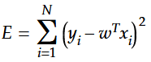

# Regression Analysis - Part 2: Multi-Dimensional Linear Regression

After deriving all the necessary equations for simple linear regression and implementing them in Python in our last article ([Regression Analysis - Part 1: Simple Linear Regression](../regression-analysis-part-1--simple-linear-regression/README.md)), it is time to take the next step - doing the same for multi-dimensional linear regression. The methods are quite similar, but be prepared to switch to matrix operations this time.

Once more I want to mention my main source of inspiration for this article, the [Udemy course about Linear Regression](https://www.udemy.com/data-science-linear-regression-in-python/) created by Lazy Programmer, as well as the platform [Mathcha.io](https://www.mathcha.io/), which I used to create all the formulas used in this article.

The full source code I wrote can be found in the Python script [multi_dimensional_linear_regression.py](multi_dimensional_linear_regression.py). As long as you have all the required modules installed ([NumPy](https://www.numpy.org/) and [matplotlib](https://matplotlib.org/)), you should be able to run the script without any parameters: ```py multi_dimensional_linear_regression.py```.

Full disclosure and some words of encouragement: I didn't have a strong background in statistics, so when I started, I had to learn some new techniques to understand multi-dimensional linear regression myself. I have worked with matrices before, but only to some extent. That's why I had a hard time in the beginning to envision what exactly happens at every stage of the process. If you are in the same boat as me, I can assure you, that we will take this step by step and I will guide you along the way.

When watching tutorials about matrix operations, it was most helpful to me, to work with actual examples along the way. Therefore, I decided to do the same in this article. That's why I start with the generation of the extended fake water study and use it during the entire article to show you what happens at every stage with the real numbers.

## Extending the Fake Water Consumption Study

You will remember that we created a fake study for the last article to illustrate simple linear regression. It showed that the warmer a day was, the more water people consumed. Now we need additional parameters influencing the amount of water consumed to achieve a multi-dimensional problem.

To keep things simple, we will only add one additional parameter - how many minutes of sports a person did on the given day. This means we want to estimate how many liters of water a person drank, by analysing two different parameters:

- How hot the day was (in °C)
- How many minutes of sports the person did that day

Those parameters are put together in our feature vector **xi** (**x** at index **i**) for each data point. The result - the amount of water consumed - is a scalar value called **yi** (**y** at index **i**) for each data point. To get a feeling of what different measurements might look like, we generate the values for our fake study and plot it in 3D:


It is not so easy to see it in a still image, therefore I recommend to run the provided Python script. You can drag the cube around, which gives you a better idea about the distribution of all the data points. Please note, that the data is generated randomly, so your output will look a little different every time.

If you want to know how the data points are generated, here is the source code of the generator function:

```python
def generate_water_stats():
    sport = np.random.randint(200, size=100)
    temp  = np.random.randint(35,  size=100)
    
    x = np.stack((sport, temp)).transpose()
    y = sport/60 + temp/10 + 1 + np.random.randn(100)/2
    
    return x, y
```

The reason we transpose **x** is that we want a matrix of the shape **N**x**D**, where **N** is the amount of data points and **D** is the amount of features. In our case, **x** will be a **100**x**2** matrix, since we generated 100 data points and have two features. **y** is vector of length **100**, which can be understood as a matrix of shape **100**x**1**.

It would be a little cumbersome to work with all 100 data points in this article, therefore we will only use the first five data points generated - again, those will vary with each run of the script. If you want to play around with those values, I hardcoded them in the function ```get_sample_data()``` in the script provided.

```python
def get_sample_data():
    x = np.array([[91, 30], [46, 10], [131, 19], [3, 5], [107, 13]])
    y = np.array([5.82, 1.8, 5.99, 1.79, 4.04])
    
    return x, y
```

That's what the sample data points look like in matrix form:


Looking just at the first line, our fake study results show, that one of the participants drank 5.82 liters of water on a day with a temperature of 30°C and the person did 91 minutes of sports on that day. Sounds reasonable. Line two shows a day with only 10°C and 46 minutes of sports - the consumption was only 1.8 liters of water. Clearly below the recommendation, but that's not our concern here. The data seems to make sense in general.

## The Plane of Best Fit

While we were looking for a line-of-best-fit in our last article, this time we are looking for a plane-of-best-fit. This term is rarely used, as it only applies to the edge case of multi-dimensional linear regression with two features. We will be working with matrixes that can fit any number of dimensions, so that we are flexible in this regard.

Our initial equation for **y-hat** looks as follows:


**w** is our weight vector of dimensionality D, in our case a column-vector containing 2 values - one for each feature. **x** is our feature matrix and **b** is a scalar value. **w** is our equivalent to **a**, and **b** our equivalent to... well... **b**, when we compare the equation to simple linear regression.

We have to place **w** after **x**, because the inner dimension of two matrices have to be the same for multiplication. In this case we have **x** (NxD) multiplied with **w** (Dx1), which works as intended.

As promised, we will look at the equation with the real numbers from our fake study next:


Please note, that we do not substitute the values for **y-hat** with our **y-values** from the water study, because **y-hat** stands for the calculated values we are looking for, not the measured values from the study.

If we are working with individual indices, e.g. calculating **y-hat** with index **1**, our equation changes a little. In this case we have to switch **x** and **w** around and transpose **w**, because by selecting a single data-point from **x**, **xi** turns into a column-vector of dimensionality D by convention:


As you can see, **w-transpose** (1xD) can be multiplied by **x1** (Dx1).

Now we can apply a little trick to get rid of **b**. We add an additional column to **x**, filled with **1**, and **b** in the corresponding position in **w**. By convention, this **b** becomes **w0** and therefore the column filled with **1**s must be the first one as well. To distinguish the modified values, we can call them **w-prime** and **x-prime**, but after showing the next equations, we will skip the prime notation for reasons of simplicity:


As we need to prepare each matrix **x** before we can work with it, we will define a simple helper function that adds a column filled with **1**s as the first column of the matrix:

```python
def add_column_with_ones(x):
    return np.hstack((np.ones((x.shape[0], 1)).astype(int), x))
```

The implementation looks a little cumbersome, but this was the easiest approach I could come up with. If you know about a better approach, please don't hesitate to contact and enlighten [me](https://twitter.com/Dementophobia).

## Minimizing the Squared Error

We simplified our equation for **y-hat** in the previous chapter. The next step is - like we did with simple linear regression - minimizing our squared error. Our initial equation for the squared error is of course the same:


This time we substitute **y-hat** with the term we derived above:



The only variables in this equation are found in the vector **w**, so we take the derivative with regard to any component of **w**, namely **w** at index **j**, where **j** ranges from 1 to D:


As you can see above, we first applied the power rule for partial derivatives. If you are not familiar with this rule, here is a quick refresher. Let's look at the following equation:


To calculate the derivative, we apply the power rule:


That's exactly what we did with our squared error equation above, including a little shortcut in the second term. If you are not sure how we arrived here, apply the power rule yourself on paper and it will become obvious.

As a next step, we will simplify the second term even more. I took the time to write it out in scalar form, so that it is easier for you to see how we get to this result:


Putting everything we've learned so far together, leaves us with the following derivative of **E** with regard to **w** at index **j**.


Our main goal is to find the global minimum of our squared error, so we set the equation for the derivative to **0**. Why this leads as to our global minimum has already been explained in the [previous article](../regression-analysis-part-1--simple-linear-regression/README.md), so I won't repeat it here.


We can get rid of the **2** and expand the brackets. Please note that **y** at index **i** as well as **x** at index **ij** are both scalar values, which makes this easy for us.


Now we can move the sums around to make them positive and remove **w-transpose** from the sum completely, as it does not depend on **i**.


You will have noticed that our sum is only concerned with index **i** but not with index **j**. This means, we can think about this equation actually as a series of **D** different equations:


We have already seen in the last article, how the sum of element wise multiplications can be written as the dot product. This would look something like this:


Applying this rule to the equation above, we can transform it as follows:


Almost there. We are still left with **w-transpose** instead of just **w**. We can get rid of this by transposing both sides, which leaves as with a still intact equation:


The last step is multiplying both sides with the inverse of **x-transpose** dot **x**:


There we have it, our final equation for **w**. Now all we need to do is use some NumPy magic to actually calculate it. We will do this in the next chapter.

But before we go there, we take a quick look at what the equation above will look like filled with our sample data points:


If you are motivated, you can solve the equation by hand and see if you get a similar result as we will get from our Python solution below. Please note, that the full data set is generated randomly and the results will of course vary a little bit because of that.

## Implementing our Results in Python

First of all we need the data matrices to work with. Those are provided by the function `generate_water_stats()`, which we already discussed in the beginning of this article.

To implement the equation we derived for multi-dimensional linear regression, NumPy offers an optimized function that we can use. `linalg.solve(a, b)` (see [documentation](https://docs.scipy.org/doc/numpy/reference/generated/numpy.linalg.solve.html)) solves the linear matrix equation for **ax = b**. The shape of the result is identical to the shape of **b**.

Doesn't this look familiar? Let's switch the second to last equation from the last chapter around:


It is easy to see that **a = x-transpose.dot(x)** and **b = x-transpose.dot(y)**. That's all we need to know to solve this equation with `linalg.solve(a, b)`.

```python
x, y = generate_water_stats()
x = add_column_with_ones(x):
x_trans = x.transpose()

w_solve = np.linalg.solve(x_trans.dot(x), x_trans.dot(y))
print(f"Calculated with solve-function:\t{w_solve}")
```

If you are skeptical about the `linalg.solve()` function - and I don't blame you - you can always try to calculate the final equation we derived above as it is:

```python
w_asis = np.linalg.inv(x_trans.dot(x)).dot(x_trans.dot(y))
print(f"Calculated 'as-is':\t\t{w_asis}")
```

The results are obviously the same:

```
Calculated with solve-function: [1.18 0.02 0.1 ]
Calculated 'as-is':             [1.18 0.02 0.1 ]
```

But why do we get a result vector with 3 values, when we only have 2 features? Well, we merged our offset **b** into our matrix, therefore the first value will always be **b** and the weights for the individual features will follow afterwards.

As we are working with only 2 features, we can now define our two-dimensional plane-of-best-fit in 3d by the following equation:


Drawing this plane in our data plot shows us, that we can't be too far from the truth:


As before, I recommend to look at the graph in Python, where you can turn the cube around to get an even better impression about the plane and the distribution of the data points. Just run the script as described in the intro of this article.

Of course I will also show you the code used to create the graph above:

```python
def plot_stats_with_pobf(x_dp, y_dp, z_dp, w):
    ax = plt.figure().gca(projection='3d')
    
    x, y = np.meshgrid(np.linspace(0, 200, 10), np.linspace(0, 35, 10))
    z = w[1]*x + w[2]*y + w[0]
    
    surf = ax.plot_wireframe(x, y, z)
    ax.scatter(x_dp, y_dp, z_dp)

    plt.title("Fake water consumption study")
    ax.set_xlabel("Minutes of sports")
    ax.set_ylabel("Temperature in °C")
    ax.set_zlabel("Liters of water")
    plt.show()
```

As a final verification, that our plane-of-best-fit works, we can take our sample values and verify by hand, how good the plane fits the data. As a reminder, here are our sample data points:


If we manually calculate the predicted **y-hat** based on our calculated values for **w**, we see that we can't predict the values exactly, but are pretty close on average:


That's it for now! We have a working and verified solution for multi-dimensional regression. Good stuff!

If you want to play around with the code for yourself, you'll find everything I coded for this article assembled in the file [multi_dimensional_linear_regression.py](./multi_dimensional_linear_regression.py).

## Where to go from here - Next Steps on our Journey

You also made it to the bottom of the second article concerning linear regression, quite impressive! As we already laid out in the first article, we are getting closer and closer to [logistic regression](https://en.wikipedia.org/wiki/Logistic_regression), which is a very important building block for artificial neural networks.

Before you take the next step, please make sure that you understood everything up to here. A good exercise will be taking a piece of paper or the math editor of your choice and try to derive the equations we have seen so far without looking at the articles. You should also try to implement them yourself in Python. If you can do that without peaking, you are good to go to continue this journey with the next chapter.

If you have any questions or spot any errors in this article, don't hesitate to drop me a message on [Twitter](https://twitter.com/Dementophobia).