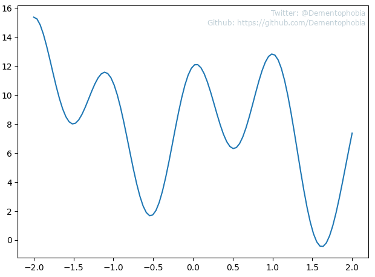

# Regression Analysis - Part 3: Polynomial Regression

If you are new to regression analysis, I suppose the first two articles in this series must have been quite a ride for you. Deriving the formulas not only for simple linear regression but also for multi-dimensional linear regression is not an easy task, so you have earned a little break - a break called [polynomial regression](https://en.wikipedia.org/wiki/Polynomial_regression)!

No, I am not joking. When I prepared to dive into polynomial regression myself, I expected another round of intense study sessions to understand the required mathematical concepts. I was quite pleased to find out that polynomial regression basically works the same way as multi-dimensional linear regression. We can utilize everything we have learned so far and just need to apply it.

Let me explain this further in the following chapters.

## A straight forward approach to polynomial regression

You studied my previous article [Regression Analysis - Part 2: Multi-Dimensional Linear Regression](../regression-analysis-part-2--multi-dimensional-linear-regression/README.md), right? You followed all the steps and in the end you were able to derive the formulas yourself? Great, because that's the prerequisite to get the most out of this article. I will assume that you have a firm grip on multi-dimensional linear regression by now and I will jump right into polynomial regression.

We have seen, that we can create a function that estimates data points based on an arbitrary amount of input parameters. In our 3d example - the fake water study - we could estimate the amount of water a person drank based on the amount of sport this person did that day and the outside temperature.

But who said that those input parameters must be independent from each other? Instead of using two different input parameter, why can't I just say the first parameter is **the temperature** and the second parameter is the **square of the temperature**? And why shouldn't I be able to introduce an arbitrary number of additional parameters and increase the degree of the resulting polynomial more and more each time?

> "Don't tell me what I can't do." - John Locke (Lost)

I'm with John on this one. So let's try it out. If this approach works in 2 dimensions with a single input parameter **x** and a single output parameter **y**, it will also work in higher dimensions with several input parameters. Nevertheless, we will keep to 2 dimensions in this article for clarity. But first - you have guessed it - we need some data to work with.

## Making up data points - again...

We are already used to making up arbitrary data points for our examples, so let's continue with this ritual. I feel like creating a rather messy curve and the following Python function allows us to do just that. You can find this function as well as all the other code I wrote for this article in the script [polynomial_regression.py](polynomial_regression.py).

```python
import numpy as np
import matplotlib.pyplot as plt

def create_2d_data_points():
    x = np.linspace(-2, 2, 100)
    y = x**5 - 6 * x**3 + 6 * x + 4 * np.cos(x*6) + 8
    return x, y
    
x, y = create_2d_data_points()
plt.plot(x, y)
plt.show()
```

On first glance, this looks like a normal polynomial, but I added a cosine wave on top to mess with it. That way it isn't so easy to find the perfect solution using polynomial regression. Let's take a look at the actual curve:



The created data set **x** and **y** contains 100 data points spread across the range -2 to 2 equally. Because there are no random values added as noise, opposed to how we created our data in previous example, you will be able to get exactly the same results as I do this time.

## Applying what we already know

You will remember our final formula from the last article:


**x** is the matrix containing the input parameter and **y** is the vector containing the output. Currently, looking at our Python script, our matrix **x** only contains the **x** values, therefore only a single column. Well, as we have learned last time, it should actually contain two columns,  because the first column is a column filled with **1** per default. We need to expand our script, re-using our already created function `add_column_with_ones(x)` from the previous article. As you can see below, we have to address a shape issue by re-shaping **x**, because in the current form **x** would be of shape (100,), but we need it to be of shape (100, 1). I used an if-statement to check for such a shape issue, so that we can use this version of the function from now on for all cases.

```python
def add_column_with_ones(x):
    if len(x.shape) == 1:
        x = np.reshape(x, (x.shape[0], 1))
    return np.hstack((np.ones((x.shape[0], 1)).astype(int), x))

def create_2d_data_points():
    [...]
    
x, y = create_2d_data_points()
x = add_column_with_ones(x)
```

Up to here, we have not entered the field of polynomial regression yet. We are still applying multi-dimensional linear regression on 2d data. Let's see how far we will get with this approach and apply our established formulas in this example.

```python
def add_column_with_ones(x):
    [...]

def create_2d_data_points():
    [...]

def line_of_best_fit(x, y):
    x_extended = add_column_with_ones(x)
    x_trans = x_extended.transpose()
    w = np.linalg.solve(x_trans.dot(x_extended), x_trans.dot(y))
    lobf = w[1] * x + w[0]
    return lobf

x, y = create_2d_data_points()
lobf = line_of_best_fit(x, y)
    
plt.plot(x, y)
plt.plot(x, lobf)
plt.show()
```

The function `line_of_best_fit(x, y)` should calculate what it name promises - the line of best fit. Let's check the result.


Not bad! It worked right out of the box. And did you just realize what we did there? We "accidently" showed that we can calculate our line of best fit using the methods from multi-dimensional linear regression without modification! So, why did we bother with the special case of simple linear regression in the first article and went through all this trouble?! Well... Squirrel!

## Using polynomials of higher degrees

By increasing the [degree of our polynomial](https://en.wikipedia.org/wiki/Degree_of_a_polynomial), we can get a better approximation of our given function, according to the [Taylor series](https://en.wikipedia.org/wiki/Taylor_series). All we have to do to achieve that, is adding the appropriate values to our matrix **x**, one column per additional degree. In Python this looks something like the following code snippet below. Please note that I skipped the print-function `print_poly_lobf_formula(w)` for brevity, but feel free to check it out in the provided script [polynomial_regression.py](polynomial_regression.py). It just prints out the actual polynomial expression, is nothing more than a quick proof of concept and should be treated as such. Yes, I know the formatting is broken in some edge cases, but I choose to ignore it as it works well enough for the purpose of this article.

What we should focus on anyway, is the function `poly_line_of_best_fit(x, y, degree)`. First, this function extends our matrix **x** depending on the given parameter **degree**. Afterwards, the line of best fit is calculated by adding all the terms together for each data point. Not the most efficient implementation with a for-loop, but a quite readable one.

```python
def print_poly_lobf_formula(w):
    [...]

def poly_line_of_best_fit(x, y, degree):
    x_extended = add_column_with_ones(x)
    
    for i in range(2, degree):
        x_extended = np.c_[x_extended, x**i]
        
    x_trans = x_extended.transpose()
    w = np.linalg.solve(x_trans.dot(x_extended), x_trans.dot(y))
    print_poly_lobf_formula(w)
    
    lobf = np.zeros(x.shape[0])
    for i in range(degree):
        lobf += w[i] * x**i

    return lobf
```

Let's look at the results for polynomials with different degrees. Let's start with degree 2, which results in the following polynomial: `y = 8.023 - 1.555x - 0.121x^2`


Wow, do you see the line bend? Do you see it? Impressive, isn't it? Oh, come on... Yeah, I'm not impressed either yet, but this is just the beginning. Let's increase the degree to 3: `y = 8.023 + 2.04x - 0.121x^2 - 1.468x^3`


See, we are getting at least a little bit better. Just keep going...

Spoiler alert, degree 4 looks almost the same as degree 3, so we are skipping it. If you want to see for yourself, you know where to find my code by now. Play around with different values and get a feeling for the behavior of polynomials with different degrees. I also encourage you to experiment with different curves by playing around with the function `create_2d_data_points()`. Reading this article is just the starting point. To get good you need hands-on experience as well.

But I digress. Here is our next polynomial with degree 5: `y = 8.455 + 6x - 1.181x^2 - 6x^3 + 0.303x^4 + x^5`


Still not what I would call a really tight fit, but we are going in the right direction. Let's continue and find out if [Taylor](https://en.wikipedia.org/wiki/Brook_Taylor) was lying to us all along or if we can improve our results further by adding more terms. Let's skip some of them to speed things up and look at the polynomial solution with a degree of 8: `y = 7.919 + 6x - 1.659x^2 - 6x^3 + 5.429x^4 + x^5 + -3.499x^6 + 0.587x^8`


It feels more and more like our solution is approaching the curve slowly but surely. Next step, degree 10: `y = 10.138 + 6x - 31.667x^2 - 6x^3 + 69.371x^4 + x^5 - 50.658x^6 + 14.663x^8 - 1.461x^10`


I feel that this is the polynomial where it becomes obvious that our approach is working. Sure, there are some gaps left, but this is already a good approximation. How fast do you think we will reach a polynomial solution that's almost indistinguishable from our curve? 10 more degrees, maybe 20?

Well, we are even faster than that! I tried it out and would already consider the solution with degree 14 good enough: `y = 11.894 + 6x - 68.282x^2 - 6x^3 + 194.477x^4 + x^5 - 211.087x^6 + 112.446x^8 - 31.918x^10 + 4.67x^12 - 0.278x^14`


Of course you can get an even tighter fit with polynomials of even higher degrees, but this solution is already really nice. Feel free to experiment and check for yourself!

And that's already it. Did I promise too much? No new formulas, no complex derivations, just applying what we know. At least to me it felt like the relaxing break I needed after the first two articles!

## Where to go from here - Next Steps on our Journey

So let's take a step back and take a look at what we have achieved in this article. We have utilized the methods of multi-dimensional linear regression to implement polynomial regression. And the results speak for themselves. As a by-product we also got a feeling for the application of the Taylor series, which is a nice bonus. And we found out, that the formula for simple linear regression can  be substituted by multi-dimensional linear regression for a one size fits all approach. What more can you ask for in a single article?

Of course we are still just at the beginning of this journey, so let's take a look around the next corner ahead. When we tried to judge the different polynomials and their "fit" today, it would have been helpful to have a method at hand to measure the quality of our solutions. Luckily for us, there is not just one but there are several such methods available to us, and that's where we should focus on next. Please take your time to study what we have learned so far, so that we can take a closer look on how to measure the quality of our solutions in the next article.

In the meantime, if you have any questions or spot any errors in this article, don't hesitate to drop me a message on [Twitter](https://twitter.com/Dementophobia).