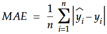
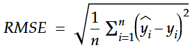
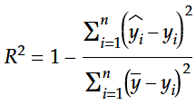
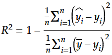
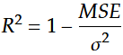
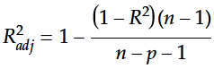

# Regression Analysis - Part 4: Regression Metrics

If you followed this series up to here, you've already learned a lot. You know how to perform [simple linear regression](../regression-analysis-part-1--simple-linear-regression/README.md), [multi-dimensional linear regression](../regression-analysis-part-2--multi-dimensional-linear-regression/README.md) and also [polynomial regression](../regression-analysis-part-3--polynomial-regression/README.md). But while this is impressive, we are not able to tell how good the models we are creating actually are. How are you supposed to compare different models without a suitable metric to find out which one works best?

I always cringed when I wrote statements like "as you can clearly see, this iteration of the model is... well... a lot better than the one before...". Sure, we have some intuition in this regard, and I am confident that we didn't make any major mistakes so far, but let's be honest - real scientific reasoning looks different.

Luckily for us, there are several different proven methods to measure the quality of our models. While all of them have their pros and cons, we will look at four selected methods today:

- [MAE](#MAE---Mean-Average-Error)
- [RMSE](#RMSE---Root-Mean-Square-Error)
- [R squared](#R-squared)
- [Adjusted R squared](#Adjusted-R-squared)

We will not only discuss those methods in detail, but also implement all of them in Python as part of this article. You can find the four functions in the script [regression_metrics.py](./regression_metrics.py). This script also contains several functions familiar to you from the article about [multi-dimensional linear regression](../regression-analysis-part-2--multi-dimensional-linear-regression/README.md), as we will use the model we created there to show some interesting behavior when adding noise to the input. More about this in the respective chapter.

## MAE - Mean Average Error

The first method we are going to discuss is the most intuitive. It does exactly what its name suggests. To calculate the MAE, we simply calculate the sum of all errors - error meaning the difference between the measured value and the value calculated by our model - and divide it by the amount of data points to get the mean. Of course we have to make all individual error values absolute, otherwise errors with opposing sign would cancel each other out.



As we have already established in previous articles, **y-hat** contains the data points calculated by our model and **y** contains the measured data points.

Using the convenient NumPy functions `absolute()` and `mean()`, we can implement this equation in a simple one-liner in Python.

```python
def mae(yhat, y):
    return (np.absolute(yhat - y)).mean()
```

While this method is easy and intuitive, it still is hardly used for machine learning. Do you have an idea, why this might be the case? We already encountered something similar in this series.

Yes, using absolute values in the equation is the cause, you are absolutely right. We encountered this issue already in the [first article](../regression-analysis-part-1--simple-linear-regression/README.md#the-line-of-best-fit). If you want to calculate derivatives, the absolute function is your worst enemy. Unfortunately, calculating partial derivatives from the error function is a central component of gradient descent. That's why the MAE isn't used widely, although it is a perfectly fine error function otherwise.

But maybe there is some kind of workaround to address this issue. Let's see!

## RMSE - Root Mean Square Error

RMSE to the rescue!

Of course there is a workaround. RMSE basically does the same as MAE, but instead of using the absolute function to get rid of the signs, it simply squares the individual errors. In the end the square root is taken to compensate for the increased values.



The square function is biased towards larger values, which means outliers will be "punished" more severely by this method. This can actually be a good thing, depending on the reason for the runaway values. But this would be a topic of its own.

As you can see, RMSE is almost as intuitive and simple as MAE, but allows us to calculate derivates with ease. We have already seen this in previous articles, where we worked with a similar function, the [squared error](../regression-analysis-part-1--simple-linear-regression/README.md#the-line-of-best-fit).

If you still remember how we used the dot product to calculate the mean of all the square values of a vector, you can derive the following function to calculate the RMSE:

```python
def rmse(yhat, y):
    diff = yhat - y
    return diff.dot(diff)**0.5
```

I like to convert the [square root to the exponent form](https://en.wikipedia.org/wiki/Exponentiation#Rational_exponents), so that I don't have to import the math module in Python. But that's a matter of taste - so if you find the `math.sqrt()` function more readable, there is no harm in using it.

RMSE is similar to MAE, while getting rid of its most important shortcoming. One would assume therefore, that RMSE is a prime candidate for an error function for machine learning - and it is! RMSE is probably one of the most used error functions, at least for now. And although the state of the art might change in the future, having a firm grasp on the concept of RMSE will be invaluable for quite some time.

## R squared

OK, so RMSE seems to be the way to go. Why should we look at additional metrics? Is this time well spent?

I can promise you, it is. R squared is a metric that allows us to measure our model from a different perspective. It is also called the [coefficient of determination](https://en.wikipedia.org/wiki/Coefficient_of_determination).

Let's look at the equation first, before we go into the details.



As you can see, the nominator is simply our well known sum of squared errors. The denominator looks similar, but instead of using **y-hat**, we are using **y-bar**, which is the average of all values contained in the vector **y**.

We can transform this equation by multiplying both the nominator and the denominator by **1/n**. This makes the interpretation easier as you will see.



Now we suddenly have the MSE (Mean Squared Error) on top and the [variance](https://en.wikipedia.org/wiki/Variance) (Sigma squared) on the bottom.



Interesting, let's analyze this further. First of all, we start with **1** as baseline, which feels arbitrary - and it is. The reason is that R squared was created to be within a range from **0** to **1**. **0** means the model only predicts the values as good as predicting the mean, which is pretty terrible. **1** means the model predicts all values perfectly, because MSE has to be **0** for such a result.

In reality R squared can even be negative, if the predictions are worse than predicting the mean. This shouldn't happen if there are no major flaws in the model. So if it does, you know you have to get back to the drawing board.

A common interpretation of R squared is that it measures the strength of the relationship between the model and the dependent variables on a scale from 0% to 100%, ignoring negative values for R squared.

We can improve R squared by decreasing our MSE. We can also improve it by increasing variance. But as you might have already realized, the variance in our data set is completely independent from our actual model. As long as our date set is fixed, MSE is our only chance to improve R squared.

Let's implement this in Python:

```python
def r_squared(yhat, y):
    diff_hat = yhat - y
    diff_bar = y.mean() - y
    return 1 - (diff_hat.dot(diff_hat) / diff_bar.dot(diff_bar))
```

Straight forward with NumPy, no surprises there.

If you want to see how close we got to the desired R squared of **1** with our polynomial models from the previous article, the next article in this series [Regression Analysis - Part 5: Measuring the quality of our polynomial models](../regression-analysis-part-5--measuring-quality-of-polynomial-models/README.md) will answer this question in detail.

But before we go there, we have a forth method to cover, called [adjusted R squared](https://en.wikipedia.org/wiki/Coefficient_of_determination#Adjusted_R2). It's basically a modification of R squared to get rid of a fundamental problem.

While it is not intuitive at first, R squared behaves interestingly when you add random noise as additional input variables. The more random noise you add, the better (closer to **1**) R squared will become. You don't believe me? I don't blame you - it took me some time to fully grasp this concept myself. What was most helpful was conducting experiments and interpreting the results. So please follow along as I guide you through this process.

Let's take our model from the [article about multi-dimensional regression](../regression-analysis-part-2--multi-dimensional-linear-regression/README.md). It is a good starting point, because this example already contains two input variables (amount of sport and temperature) and we can easily add additional ones with random noise. We will re-use most of the code and add the functionality we need to conduct our experiment. Feel free to play around with the script [regression_metrics.py](./regression_metrics.py) and conduct your own experiments to get a feel for it.

Please note that the data is generated randomly and will therefore differ each time. This also means that the resulting R squared will vary (within reasonable boundaries). Within a single run of the script the data points will of course stay the same, otherwise the experiment wouldn't make sense.

Let's take a look at the key functions:

```python
def calculate_yhat(x, y):
    x_trans = x.transpose()
    w = np.linalg.solve(x_trans.dot(x), x_trans.dot(y))
    return sum([w[i]*x[:,i] for i in range(x.shape[1])])
```

First of all we need a function that calculates **yhat**. Creating this function was basically what the second article in this series was all about. At that time we hardcoded the sum for better readability. You may remember the following line of code:

```python
z = w[1]*x + w[2]*y + w[0]
```

Now we are dealing with arbitrary dimensions, because each column of noise adds another dimension to our model. The list comprehension in the last line gets us this flexibility.

```python
def add_noise(x):
    noise = np.random.rand(x.shape[0], 1)*10
    return np.hstack((x, noise))
```

Adding noise is easy. We append a column with random values from **0** to **10** to our matrix of input variables **x**. We will do this with every iteration as you are about to see, to find out how R squared will change when we keep adding noise.

```python
x, y = generate_water_stats()
x = add_column_with_ones(x)

for i in range(10):
    yhat = calculate_yhat(x, y)
    print(f"R squared with {i} noise variables added: {r_squared(yhat, y):.5}")
    x = add_noise(x)
```

This is the main control structure. First we prepare the data and add an initial column of **1**s to **x**. Once the data is ready, all we have to do is calculate **yhat** and call the function `r_squared(yhat, y)`, which we already discussed above. During the first iteration there is no noise added. With each additional iteration we add one column of noise at a time. Here is the output of the script:

```
R squared with 0 noise variables added: 0.88989
R squared with 1 noise variables added: 0.90112
R squared with 2 noise variables added: 0.90118
R squared with 3 noise variables added: 0.90377
R squared with 4 noise variables added: 0.91031
R squared with 5 noise variables added: 0.91043
R squared with 6 noise variables added: 0.91058
R squared with 7 noise variables added: 0.91408
R squared with 8 noise variables added: 0.91451
R squared with 9 noise variables added: 0.91471
```

First of all, our initial model achieves an R squared of ~0.89, which is decent. As you can see, with each iteration our R squared keeps getting better and better. It never drops, and that's not a coincidence. It has to be that way. This feels counter-intuitive. Adding noise should not benefit our model, but it actually looks that way.

There is an explanation for this behavior. When we add noise, we would expect the noise to be totally uncorrelated with our output. If that's really the case, the model would set the respective weight to **0** and there would be no impact on the result. No harm done. But it is quite likely that there is at least a slight correlation by sheer chance. The weight will be non-zero in this case, and the MSE will actually improve, leaving us with **a better R squared**! Crazy, I know, but the experiment shows that it really works that way.

To finish this chapter, I want to answer a final question. Will R squared converge and reach **1** if we keep adding noise and how long will it take? Yes, it will converge and it doesn't take very long, at least in our example it hand. I ran the script several times and almost always we reached a value of **1** when we added **97** columns of noise:

```
R squared with 94 noise variables added: 0.99794
R squared with 95 noise variables added: 0.99897
R squared with 96 noise variables added: 0.99998
R squared with 97 noise variables added: 1.0
R squared with 98 noise variables added: 1.0
R squared with 99 noise variables added: 1.0
```

## Adjusted R squared

To deal with the noise issue, an improved method was invented, called **adjusted R squared**. It takes the amount of variables into consideration and you can only push the value up by adding meaningful data to the input variables. Here is the equation:



As you can see, we calculate R squared like we already learned to do it. But instead of taking it for face value, we take the amount of input variables **p** (excluding the constant term) into account, as well as the amount of data points **n**.

This equation is easily transformed into Python code:

```python
def r_squared_adj(yhat, y, x):
    n = x.shape[0]
    p = x.shape[1] - 1
    return 1 - ((1 - r_squared(yhat, y)) * (n - 1)) / (n - p - 1)
```

The adjusted R squared will never be above R squared. If we repeat our experiment from the last chapter, we should be able to verify that:

```
Noise variables: 0      R2: 0.89338     R2 adj: 0.89118
Noise variables: 1      R2: 0.89387     R2 adj: 0.89055
Noise variables: 2      R2: 0.89417     R2 adj: 0.88972
Noise variables: 3      R2: 0.89719     R2 adj: 0.89172
Noise variables: 4      R2: 0.89812     R2 adj: 0.89154
Noise variables: 5      R2: 0.8987      R2 adj: 0.89099
Noise variables: 6      R2: 0.90079     R2 adj: 0.89207
Noise variables: 7      R2: 0.90321     R2 adj: 0.89353
Noise variables: 8      R2: 0.90323     R2 adj: 0.89235
Noise variables: 9      R2: 0.90392     R2 adj: 0.89191
```

Seems like we were successful! The adjusted R squared is indeed always clearly below R squared. And even more important, it is **not** increasing with every iteration opposed to R squared. One more concept verified through experimentation. Feel free to play around with the script yourself and check if you get similar results.

## How does noise affect MAE and RMSE?

I was already at the proof-reading stage of this article, when it struck me. So far I have only read about R squared in regard to the "noise issue". But why shouldn't the same apply to MAE and RMSE? It obviously must have the same effect there, if the theory behind it is sound.

Well, let's find out and do a re-run of the previous script - this time including all four metrics:

```
Noise variables: 0      R2: 0.89145     R2 adj: 0.88921 MAE: 0.39035    RMSE: 4.9914
Noise variables: 1      R2: 0.89221     R2 adj: 0.88884 MAE: 0.39186    RMSE: 4.9739
Noise variables: 2      R2: 0.89551     R2 adj: 0.89111 MAE: 0.38446    RMSE: 4.8973
Noise variables: 3      R2: 0.89779     R2 adj: 0.89236 MAE: 0.38172    RMSE: 4.8434
Noise variables: 4      R2: 0.8981      R2 adj: 0.89153 MAE: 0.38126    RMSE: 4.836
Noise variables: 5      R2: 0.89814     R2 adj: 0.89039 MAE: 0.38117    RMSE: 4.8352
Noise variables: 6      R2: 0.89849     R2 adj: 0.88956 MAE: 0.38417    RMSE: 4.8269
Noise variables: 7      R2: 0.899       R2 adj: 0.8889  MAE: 0.382      RMSE: 4.8147
Noise variables: 8      R2: 0.89949     R2 adj: 0.8882  MAE: 0.38095    RMSE: 4.803
Noise variables: 9      R2: 0.90094     R2 adj: 0.88855 MAE: 0.37741    RMSE: 4.7684
```

Bingo! As you can see, MAE and RMSE keep improving (lower values are better) as well with added noise. The explanation is the same that we've already discussed concerning R squared.

This is of course no new discovery and well known in the field. But it was new to me at the time of writing this article. It shows the importance of really working through new material and do hands-on experimentation. If I would have just read about those methods, I would never have reached a deep enough understanding to come to such conclusions myself. So please go out there and get your hands dirty - it pays off!

## Where to go from here - Next Steps on our Journey

If you have worked through the presented material carefully, you will now have a firm grasp on the four presented methods to measure the quality of regression models. You should also understand their individual pros and cons, so that you can decide which one is the most suitable for a given situation.

The next step will be - as promised - applying those four metrics to our polynomial models to see how the metrics behave with increasing degree of our polynomials. This will also put our Python implementations to the test. Curious about the results? Check out [Regression Analysis - Part 5: Measuring the quality of our polynomial models](../regression-analysis-part-5--measuring-quality-of-polynomial-models/README.md)!

If you have any questions or spot any errors in this article, don't hesitate to drop me a message on [Twitter](https://twitter.com/Dementophobia).