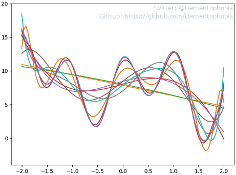
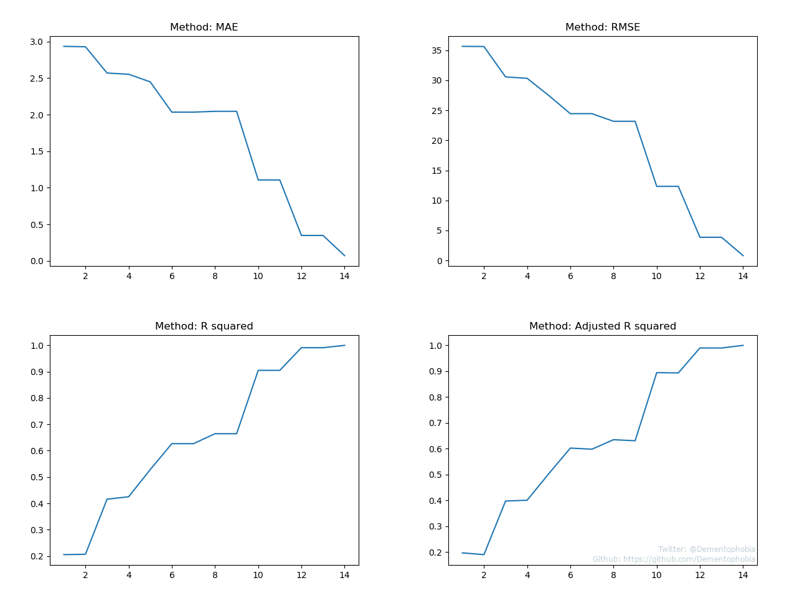

# Regression Analysis - Part 5: Measuring the Quality of Polynomial Models

Welcome to part 5 of the [Regression Analysis series](../README.md#regression-analysis)! Today we will talk less about new concepts but spend more time on actually applying what we have learned so far. Hands-on experience is key for really understanding new topics, so I decided to make enough room for it in this article.

I assume you have already worked through the previous articles, especially [polynomial regression](../regression-analysis-part-3--polynomial-regression/README.md) and [regression metrics](../regression-analysis-part-4--regression-metrics/README.md). Those are important prerequisites for today's journey.

Do you remember how we kept improving our polynomial regression model step by step in [part 3](../regression-analysis-part-3--polynomial-regression/README.md) by increasing the degree of the polynomial? Then you will also remember how helpless we were comparing those models concerning their quality. We had a feeling that we are going in the right direction, but we lacked a method to measure and thereby verify the quality improvements.

That's why we discussed four different methods that allow us to measure the quality of regression models in [part 4](../regression-analysis-part-4--regression-metrics/README.md) of the series. We learned about MAE, RMSE, R squared and adjusted R squared. Today we want to apply all four of them to get a feeling for how they work in practice and also to put our polynomial models to the test.

Of course you are free to just lean back and watch the results, but I would like to encourage you to play around with the metrics and maybe even your own models instead, as you follow this article. The full source code is provided in the script [measuring_polynomial_models.py](./measuring_polynomial_models.py). I refer to the source code in this article less than usually, because most of the code is just creating the different charts and should be rather self-explanatory. And the important functions have already been covered in previous articles.

## The Stage is open for our Models

Let's begin by taking a look at our target curve, which gives us the data points to work with:


Our goal is to fit a model to the underlying data points using polynomial regression. We have already seen that a polynomial of degree 14 almost fits perfectly, while polynomials with a lesser degree are further off. Therefore, we will analyze all polynomials from degree 1 to 14 and compare them based on their quality metrics.

How different do they look, you may ask? Well, I plotted all of them on a single chart for illustration:



Some of them are overlapping completely, but at least 10 curves can be easily distinguished with the naked eye. We will discuss the reason for the overlapping curves a little later. First I want to show you the individual curves, sorted by their degree, including all four metrics:


That's the level of detail we need to discuss the quality of the curves, good stuff!

We will go into the individual analysis of each metric in the next chapter, but by glancing over the values, we can already see, that each value moves in the expected direction. But there are some steps that behave oddly, for example the transition from **degree 6** to **degree 7** or **degree 8** to **degree 9**. The quality values stay the same at these steps, except for R2-adj, which gets worse. What happens at those steps?

Let's investigate further and take a look at the actual polynomials.

Polynomial with degree 6:

```
y = 7.04 + 6x + 6.107x^2 - 6x^3 - 5.061x^4 + x^5 + 0.965x^6
```

Polynomial with degree 7:

```
y = 7.04 + 6x + 6.107x^2 - 6x^3 - 5.061x^4 + x^5 + 0.965x^6 + 0x^7
```

Wait a second... Those two polynomials are actually the same! It looks like **x to the power of 7** doesn't have any correlation to our data points, therefore the respective weight was set to **0**. This explains why the curves look the same and have the exact same metrics.

But why does our adjusted R squared step out of line? Why is the value getting worse if the model stays the same? Well, do you remember our experiment from the previous article? We added random noise to the input parameters and analyzed what happens to our metrics. And if there is not enough correlation between the noise and the actual data points, the adjusted R squared dropped. In our case, there seems to be absolutely no correlation, because the respective weight was set to **0**. Therefore, the adjusted R squared is supposed to drop, as we can witness in this example.

Interesting - what started out as a puzzling observation could easily be explained by considering what we have learned so far. Seems like the lessons are paying off!

## Comparing individual metrics

Let's take a closer look at the progression of the quality values when we move from degree to degree:



On first glance the results look pretty similar. Of course the R squared methods are inverted and the actual values on the y-axis differ, but if you would normalize the charts and flip the respective curves, the curves would most likely agree with each other in most areas. One thing that can be spotted with the naked eye is a small difference comparing degree 12 and degree 14. MAE and RMSE show a significant improvement while the R squared methods show almost no improvement.

But to remove the guesswork, let's actually normalize the curves, flip them and plot them on a single chart:


First of all, the values for MAE and RMSE do not really make any sense in this chart. By inverting and normalizing them, they have been transformed into something totally different. This isn't a concern though, because the idea of this exercise is not to analyze the actual values, but to get a feeling for the similarities of all four metrics. At least in our simple polynomial regression example the different methods behave in such a similar fashion, that we can consider all of them suitable to compare the different models. The general trend is the same and there are no other peculiarities as well.

## How good are our Models

That's the question which inspired this article in the first place, so let's get to it.

Our first models - let's say polynomials of **degree 4 or less** - have been really bad. MAE tells us that the average error was at least **2.5**, the (adjusted) R squared is below **0.5**.

Continuing from there, we made almost constant progress with every step, until the model turned reasonable around **degree 10**. Agreed, MAE still showes that we are off by **1** on average, but an (adjusted) R squared of around **0.9** is pretty decent.

**Degree 12** and **degree 14** are our next milestones. At **degree 12** MAE did still show an average error of **0.35**, but both R squared versions gave us impressive values around **0.99**, something you will hardly ever encounter in real world examples. And once we reach **degree 14**, MAE is below **0.1** and the R squared metrics climb to **0.999**. That's more than we could actually wish for.

Retrospectively I would say, we can pat ourselves on the back, we did a good job. If only real world data-sets would always be that easy.

## Where to go from here - Next Steps on our Journey

This article concludes our analysis of quality metrics, at least for now. It's time for something different!

After we have invested such a lot of effort into linear regression models, we will switch gears in the upcoming articles. The next articles will be going into the details of [logistic regression](https://en.wikipedia.org/wiki/Logistic_regression) and [gradient descent](https://en.wikipedia.org/wiki/Gradient_descent), two invaluable disciplines when it comes to the fundamentals of modern machine learning. At the time of writing, I am not sure about the sequence of those articles, but rest assured that both topics will be covered. If you are confident, that you have learned the material presented up to here enough, I am happy to have you as a companion for the next steps on our journey.

If you have any questions or spot any errors in this article, don't hesitate to drop me a message on [Twitter](https://twitter.com/Dementophobia).