# Regression Analysis - Part 6: Gradient Descent

Welcome to part 6 of the [Regression Analysis series](../README.md#regression-analysis)! After spending five full articles about Linear Regression, I was eager to dive into Logistic Regression next. But we haven't talked about one of the most important core techniques for machine learning yet - Gradient Descent. And while Linear Regression allows us to solve many different examples with closed-form solutions, Logistic Regression only allows us to do this in certain edge cases. Gradient Descent is the go-to solution for this and many other problems. Therefore, we will have to talk about this topic first, to avoid unnecessary detours in our explanations.

We are already pretty familiar with our polynomial models from [part 3](../regression-analysis-part-3--polynomial-regression/README.md), as we have used them several times since. So why not utilize them to show how gradient descent works as well? But before we go there, we will take a quick look at the theory behind gradient descent.

If you have followed this series from the beginning, you know the drill by now. I always provide the full source code used to create the examples in my articles. This time it can be found in the script [gradient_descent.py](./gradient_descent.py) and you are highly encouraged to play around with the examples yourself to deepen your understanding of the subjects discussed.

## Gradient Descent in Theory

Regression analysis and most neural networks are at their core minimization or maximization problems. Remember, one of the main challenges in the first article about Simple Linear Regression was figuring out a way to [minimize the squared error](../regression-analysis-part-1--simple-linear-regression#minimizing-the-squared-error). This basic idea stuck with us since.

As long as the equations are simple enough, we can find closed-form solutions that allow us to calculate the desired result. But with more and more complex equations, this approach gets less and less feasible.

Gradient Descent allows us to approach the solution step by step, as we follow the gradient toward a local minimum or maximum, depending on the direction we are stepping. The easiest way to show this, is with a simple 2 dimensional example.

### 2D Example

Let's define the following function:

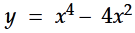

In this example, the local minima can be spotted with the naked eye, but with increasing dimensions, this task will soon become impossible to do.

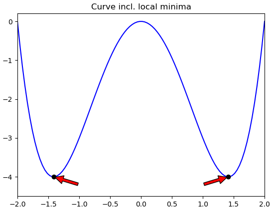

To warm up our calculus fundamentals, we will calculate the [derivative](https://en.wikipedia.org/wiki/Derivative) to get the exact values for our minima. We require them to verify that our gradient descent solution is accurate.

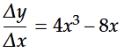

The derivative gives us the slope of the tangent for each point on our function. Because all local maxima and minima will have a slope of **0**, we can locate those points by setting our derivative to **0** and solve the equation. If you are not able to do this by hand, now is a good time to stop and study calculus again. Otherwise the next steps will definitely be too difficult for you. Investing some time to refresh calculus will pay off immensely in the long run.

Our solutions are:

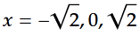

Now it is time to pretend that we are not able to calculate these results directly. What we are going to do is choose a random point on our curve and follow the gradient until we are satisfied with our solution. We will always follow the gradient downwards, as we are looking for a local minimum.

Because every starting value is fine for us and `x = 0.5` results in an easy to draw demonstration, we will choose this value for our example.

So what is the slope of the tangent at `x = 0.5`? Our function for the derivative tells us, it is **-3.5**. This is a negative number,  therefore we suspect our local minimum further to the right. But how far should we go? The steeper the curve, the farther the local minimum will usually be away.

So should we use the slope directly and add **3.5** to **x** for our next iteration? In our example we would end up at `x = 4`, which is definitely worse than where we are now. What can we do? We introduce a new variable, the **learning rate**. The learning rate is the factor we multiply the slope with to fine tune how big of a jump we want to make with each iteration. The learning rate is one of several common hyper-parameters used in machine learning. It can be chosen freely, but depending on your choice, the performance of the model will vary significantly. It is common practice to vary the learning rate during the approximation process (for example decrease it as you get nearer to your target), but we will work with a constant learning rate to keep things simple for now.

I suggest we go with a constant learning rate of **0.1** in our example. Which values are good for certain problems is not always easy to tell, but you'll get more and more comfortable with choosing values as you gain experience with it.

Multiplying our slope with our learning rate, we end up with a jump of **0.35**. Our new x is therefore **0.85**. We can do this again and again. Let us do it once more by hand, before we leave the rest to Python. The slope at `x = 0.85` is **-4,3435**, even steeper than before. We multiply this value with our learning rate and add it to x (actually we subtract it, as we want to go in the direction of the minimum). This time we land on **1,28435**. The slope at `x = 1,28435` is **-1.8**, so we keep going in that direction. You get the idea.

It will require several more steps to reach our destination, therefore it is time to implement this algorithm in Python to speed things up:

```python
def example_gradient_descent_2d():
    x  = 0.5
    lr = 0.1

    for i in range(100):
        print(f"Iteration {i+1:>3}: x = {x}")
        x -= lr * (4*x**3 - 8*x)
```

It is as easy as it looks. Of course we could be fancy and design a more intelligent stop condition instead of running 100 iterations no matter what, but for a quick demo this is good enough. As you can see, we approach our solution, the **square root of 2**, rapidly and depending on the required precision, we could already be satisfied with our result after the first **10** iterations.

```
Iteration   1: x = 0.5
Iteration   2: x = 0.8500000000000001
Iteration   3: x = 1.28435
Iteration   4: x = 1.46438765411485
Iteration   5: x = 1.3797863467625662
Iteration   6: x = 1.4328748060543621
Iteration   7: x = 1.4024232304147255
Iteration   8: x = 1.4210525060826638
Iteration   9: x = 1.4100306949258534
Iteration  10: x = 1.4166936197738516
[...]
Iteration  98: x = 1.4142135623730951
Iteration  99: x = 1.414213562373095
Iteration 100: x = 1.4142135623730951
```

Of course we can visualize what is happening by zooming in and drawing the different steps. Let's take a look at the first 6 steps we are taking - starting at our "random" position 0.5, following the gradient towards the local minimum.

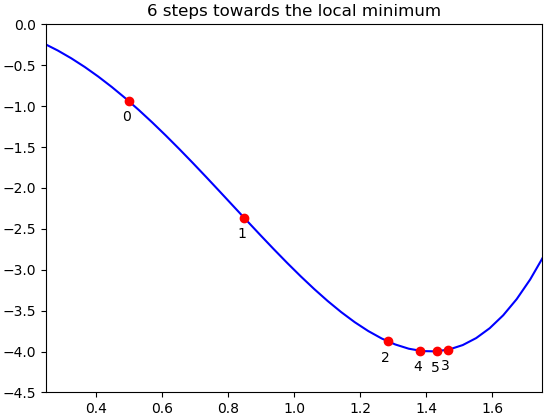

As you can see, step 3 overshoots the target clearly, but this is no problem for us, because the gradient now points towards the other direction and we move back a little to reach step 4. The pendulum swings back and forth until it can finally rest at the local minimum.

### Adding a third dimension

At first glance, a third dimension destroys our approach for gradient descent, because it introduces a second input variable. This doesn't allow us to calculate the required derivative anymore.

Luckily we can still achieve our goal by calculating the partial derivatives for all input variables, get the gradients and follow all of them within the respective dimensions.

Let's define the following function for our 3d plane:

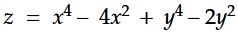

If you cannot imaging what the plane looks like, here's a wireframe model that might help:

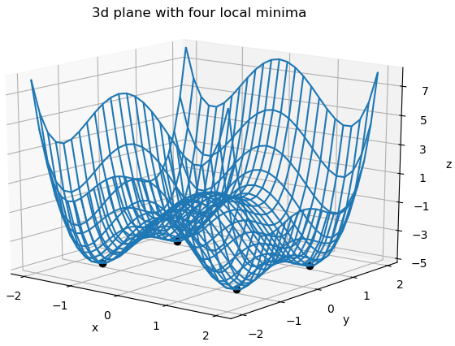

As usual, it is quite difficult to understand a 3d plane from a single screenshot. I recommend you run [gradient_descent.py](./gradient_descent.py) for yourself, where you can move the plane around in all 3 dimensions.

The four black dots show the four local minima this plane exhibits. But let's assume again that we do not know where they are. Time for gradient descent! And since `x = 0.5` worked so well last time as starting point, why not take `x = 0.5, y = 1.5` this time?

Oh, we almost forgot an important piece of the puzzle. Before we can calculate our partial gradients, we have to calculate the partial derivatives. Here they are:

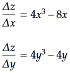


We could do it manually first like we did in the 2d example, but the approach is best understood looking at the implementation of this algorithm in Python. Please note that I changed the learning rate to **0.03**, because the graph below will look nicer that way, but keeping the learning rate at **0.1** would work as well:

```python
def example_gradient_descent_3d():
    x  = 0.5
    y  = 1.5
    lr = 0.03
    steps = []

    for i in range(100):
        print(f"Iteration {i+1:>3}: x = {x} / y = {y}")
        x -= lr * (4*x**3 - 8*x)
        y -= lr * (4*y**3 - 4*y)
```

As you can see, we follow both gradients in the respective dimension in a single step. The rest of the algorithm is exactly the same. This means, as long as we are able to calculate the partial derivative of all input variables, we can perform gradient descent on functions with an arbitrary amount of dimensions.

Here is the output of the function:

```
Iteration   1: x = 0.5 / y = 1.5
Iteration   2: x = 0.605 / y = 1.275
Iteration   3: x = 0.723626585 / y = 1.179279375
Iteration   4: x = 0.8518269828481037 / y = 1.1239900628161006
Iteration   5: x = 0.9820942383739737 / y = 1.0884692350179481
Iteration   6: x = 1.1041281968067935 / y = 1.0643358768376623
Iteration   7: x = 1.207593964433538 / y = 1.0473732334248598
Iteration   8: x = 1.2860948394797294 / y = 1.0351829791012501
Iteration   9: x = 1.3394873338158573 / y = 1.0262882148739283
Iteration  10: x = 1.3725630827843611 / y = 1.0197280779769733
[...]
Iteration  98: x = 1.414213562373095 / y = 1.0000000000006164
Iteration  99: x = 1.414213562373095 / y = 1.0000000000004685
Iteration 100: x = 1.414213562373095 / y = 1.0000000000003562
```

Looks reasonable. **x** approaches the **square root of 2** and **y** approaches **1**. Taking a quick look at the wireframe plane above, we will see, that we have found the right most local minimum that's marked there. If you don't believe me, feel free to calculate the slope of the tangent in this point and you will see that it is exactly **0**.

To visualize our 3d gradient descent, we zoom in and draw the first 10 steps on our way to the local minimum:

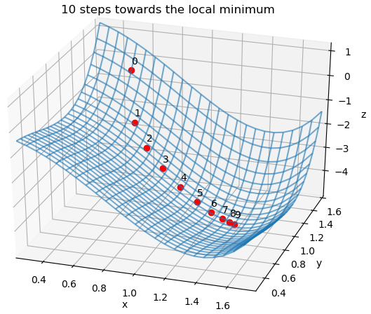

As you can see, our position gets closer and closer to the local minimum with each step. The steps become smaller towards the end, as the gradients become less steep. 

How should we interpret our result? Does this mean our local minimum is also the global minimum and therefore the best possible solution? No, it might actually be a really weak solution if we managed to choose an unfortunate starting point and get trapped in a local minimum that is way above the global minimum. In our specific case, all four local minima are equal, but in a real world scenario you actually don't know if there would be a better minimum available and how far you are off.

Speaking about real world application, let's test our theories out in practice!

## Gradient Descent in Practice

Many classes and tutorials about gradient descent end here. They show you how to find a local minimum in a save and well-constructed environment, but they do not show you what happens as soon as things get nasty.

A good showcase would be our final model from the article about [polynomial regression](../regression-analysis-part-3--polynomial-regression/README.md). We created a polynomial of degree 14 based on our closed-form solution. If we want to find such a solution with gradient descent, this should be easy, right?

Well, if you think so, please take your time and write down the equation you want to find the minimum in. If you can do this on your own, you are already on the right track. If you struggle, we can walk the next steps together.

First of all, what do we want to minimize? The error of our model of course. And if you think back to the first article of this series, you will remember that everything started with exactly this error function - the sum of squared errors:

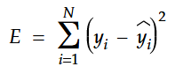

This should look familiar to you by now. **y** contains the actual target values and **y-hat** contains our predictions. In other words, **y-hat** contains the parameters **x** multiplied with the respective weights **w**. With this in mind, we can rewrite our function:

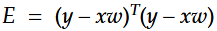

This form makes calculating the derivative wrt **w** easier for us. We can mostly ignore that we are dealing with matrixes here, as long as we keep an eye on which matrixes need to be transposed. We arrive at the following solution:

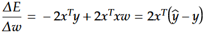

One more simplification is dropping the factor **2**, because it only influences how steep the slope is. During gradient descent, this can easily be considered in the learning rate, as this is the only point where we are concerned with the actual steepness of the slope. This leaves us with the following equation:

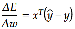

Somehow this equations just feels right. Take your time to let it sink in, what we have in front of us here. I personally was surprised by the elegance of this solution. Thinking about it, one could actually come up with this equation by pure reasoning, without calculating any derivatives. If you don't see it right away, take your time. You won't regret it!

After the moment of awe has passed, it is time to go back to good old Python and implement the algorithm:

```python
def gradient_descent_polynomial(degree = 1, lr = 0.001, iterations = 100):
    x = np.linspace(-2, 2, 100)
    y = x**5 - 6 * x**3 + 6 * x + 4 * np.cos(x*6) + 8
    x_extended = add_column_with_ones(x)
    
    for i in range(2, degree+1):
        x_extended = np.c_[x_extended, x**i]

    w = np.random.rand(degree + 1) - 0.5
    for _ in range(iterations):
        gradients = x_extended.T.dot(x_extended.dot(w) - y)    
        w = w - lr * gradients
   
    yhat = x_extended.dot(w)

    [... formatting the plot ...]
    
    plt.plot(x, y)
    plt.plot(x, yhat)
    plt.show()
```

As you can see, the first few lines are just preparing our variables **x** and **y**. It gets interesting at line 9, where we initialize our random weights. There are better ways to initialize those weights, but for our simple scenario this is good enough. After the initialization, we just do gradient descent over and over in a for-loop. If you look closely, you will see that the formula for the gradients in line 11 is the same that we just derived above.

If we did everything right, we should be able to calculate polynomials with arbitrary degree using gradient descent. Let's start with an easy one and work up from there. In the last article, we analyzed all closed-form polynomials from degree 1 to degree 14. Let's compare our gradient descent versions with those optimal closed-form solutions.

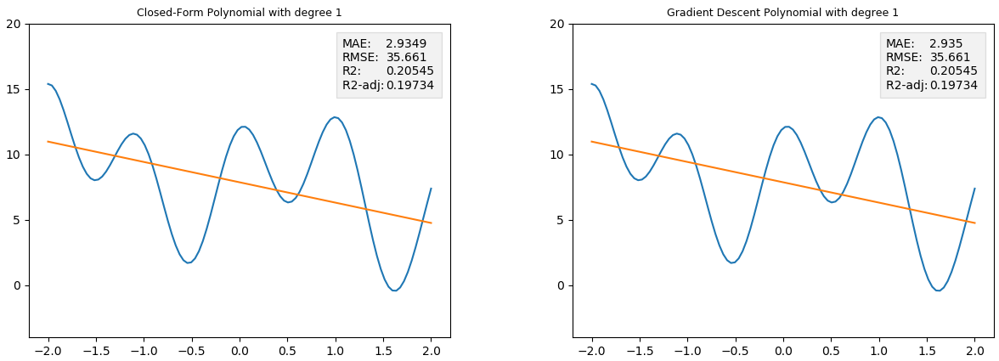

Fascinating, we were able to derive almost the exact same solution. If you take a loot at the metrics, they are more or less identical. That's what I call a good start.

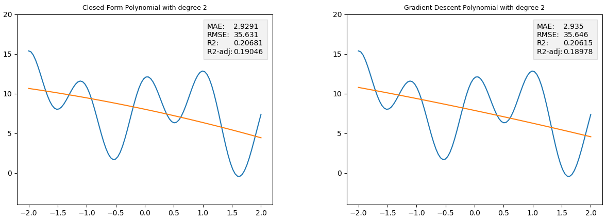

Okay, our new version is a little worse than the optimal solution, but to be honest - the difference is indistinguishable with the naked eye and only our metrics give away that we are a little off.

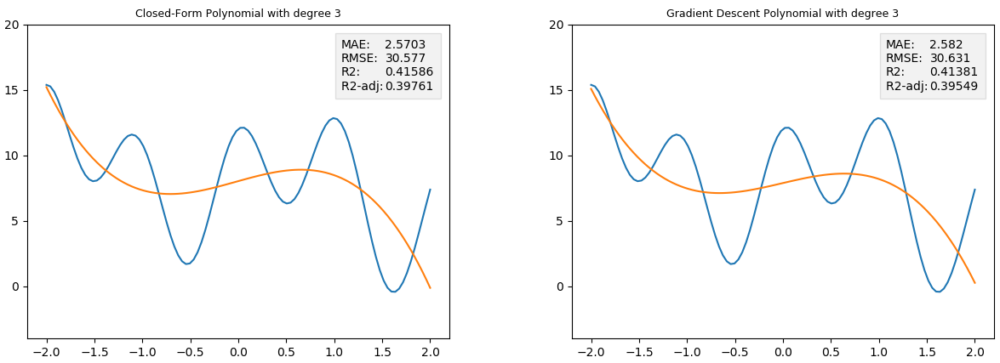

The same as before. A little worse than optimal, but basically the same solution. Seems like we can set the script to auto-pilot and keep increasing the degrees from here on.

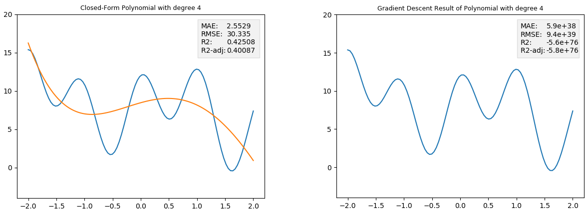

Wait... what?! Are you kidding me? Looks like we were to optimistic. Those readings are totally of the charts. Is our script playing tricks on us? Und where the hell is our curve?! Let's zoom out and see if we can find it...

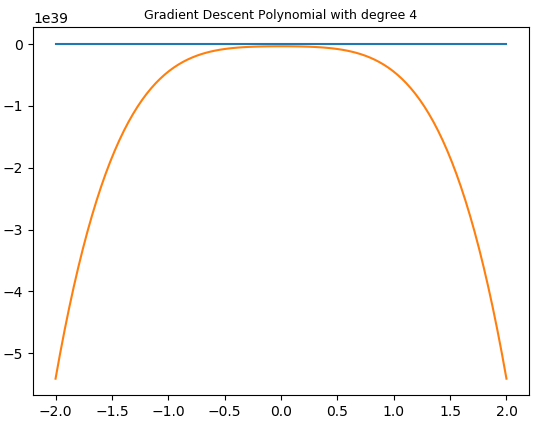

Okay... there it is... No wonder our metrics show insane numbers. Just take a look at the scaling of the y-axis. But we didn't change anything, how can this be?

### Interlude: Debugging this Mess and reconsidering Life Choices

I want to be honest with you. When I encountered this issue, I spent a lot of time debugging the script in vain. Then I went for a walk. A long walk, reconsidering all of my choices in life. When I came back, I still hadn't figured out what just happened. As soon as we introduce the fourth degree, everything goes haywire. The gradients explode within the first few iterations and everything goes south from there on. 

Then I realized that degree 4 also was special when we worked with the closed-form solution, as the weight was zero for **x to the power of 4** - I'm sure you remember this behavior from our [last article](../regression-analysis-part-5--measuring-quality-of-polynomial-models/README.md#the-stage-is-open-for-our-models). Maybe it would help to initialize the respective weight with **0**. Of course this would be cheating as we are using knowledge that we wouldn't normally have, but in the field of debugging everything is fair game.

Again, utter failure. The gradients were as unstable as before, going through the roof in no time. I felt like the crew in Chernobyl back in 1986. Weird readings all over the place, everything I tried was in vain and nothing made sense any more. Granted, there was no radioactivity involved, no lives at stake and not a single core did melt. Well, maybe it was a little different after all. But, I'm rambling... Time to wrap this interlude up before I go of the rails completely...

### Fixing the Issue

After playing around with so many values, I finally found the obvious one that actually mattered. The learning rate! The higher the degree of our polynomials, the larger the gradients. And if we do not adjust the learning rate accordingly, we jump from bad to even worse locations on our multi-dimensional function with even higher gradients. This quickly builds up to the mess we encountered above.

Reducing the learning rate from **0.001** to **0.0001** was already enough to fix the issue, at least for now.

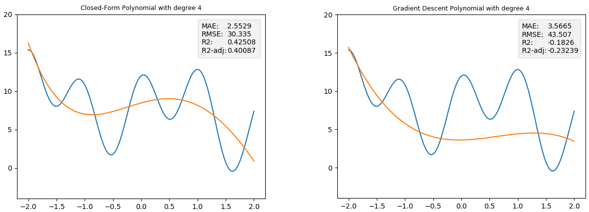

Okay, we are back in the game. But to our dismay, the gradient descent version is so much worse than the optimal closed-form solution. And not just a little, R squared is below zero! That means it is worse than just predicting the mean. And for such a result, this definitely was too much work.

Luckily there is one more parameter to tune. **100** iterations were fine until now; maybe we need to increase the amount of iterations that we allow the script to run. Let's go with **1000**.

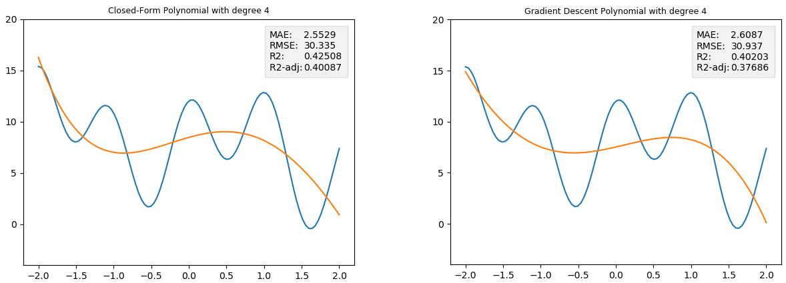

Now we are really where we want to be. We fixed the **learning rate** so that the model actually converges and we showed that we can improve the results significantly by increasing the amount of **iterations**. While this is good news, this also shows us some of the problems of gradient descent. The hyper-parameters must be chosen carefully to get good results, and the more complex our model gets, the more iterations and therefore time and resources we have to invest.

Let's see how far we get with our approach. **10000** iterations are finished in no time, so we will set this parameter as long as we are satisfied with the result. Trial and Error showed, that we can keep the learning rate at **0.0001** for degree 5.

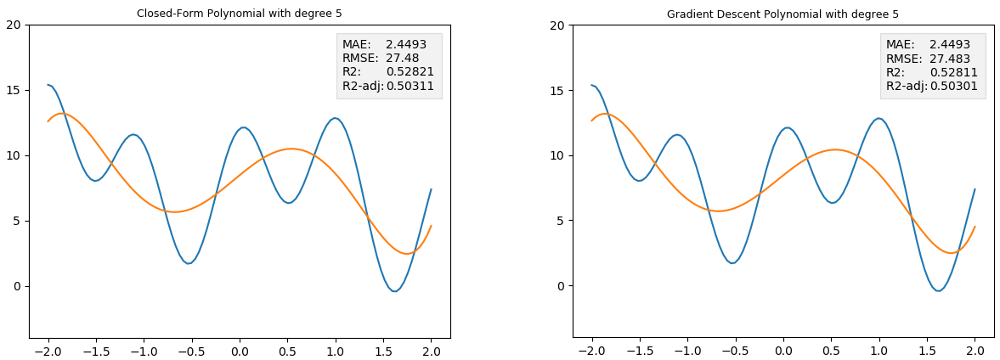

Wow, increasing the iterations really paid off! We are almost as good as the optimal closed-form solution.

For degree 6 to work, we have to reduce the learning rate to **0.00001**. The quality is also no longer satisfactory with 10000 iterations, therefore we bump it to **100000**.

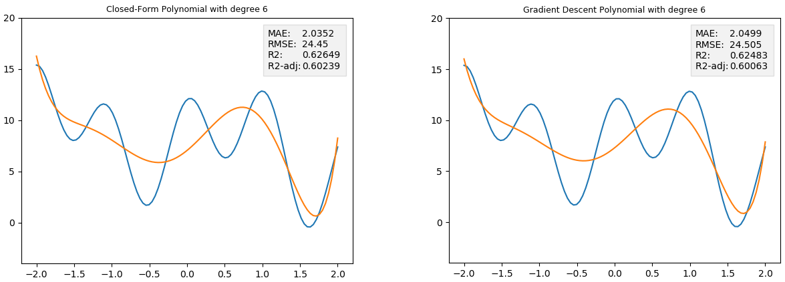

The graphs and the metrics speak for themselves. We are still on the right track. For degree 7 we are fine with the current hyper-parameters.

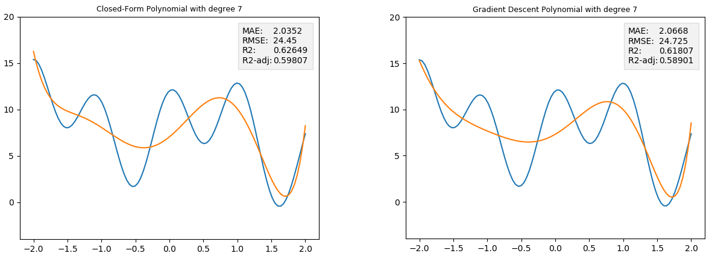

Degree 8 only converges if we reduce the learning rate to **0.000001**. The **100000** iterations are still fine. Unfortunately, we have no good way to choose the ideal learning rate without trial and error. This process can be automated of course, but there isn't a simple equation that calculates the learning rate for you.

The amount of iterations on the other hand could be substituted with something more elegant. The script could for example stop executing, once a certain target metric is reached (e.g. the sum of all gradients are below a certain threshold). We won't implement such a mechanism this time, but in a real world scenario, this will most likely be the way to go.

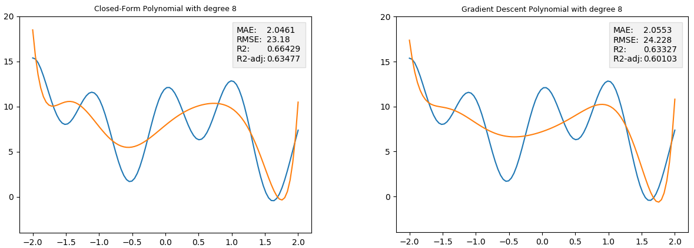

Degree 9 works fine with a learning rate of **0.000001**, but the quality with 100000 iterations is dropping a little. It's time to bump it to **1000000** - one million iterations!

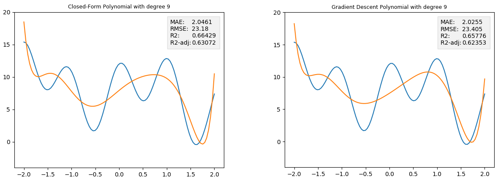

Degree 10 requires us to reduce the learning rate even further. After the reduction, we are already down at **0.0000001**. Unfortunately we cannot reproduce the amazing results of the closed-form solution with "only" one million iterations. Going to 10 million (**10000000**) iterations makes to script so slow, that you can feel the waiting time. On my test machine the script ran for 84 seconds. And the results are still not even close to the optimal closed-form solution.

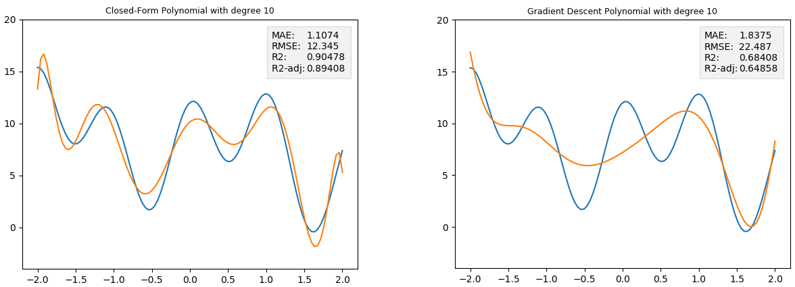

Well, if that's not enough, let's throw 10 times the iterations at the problem and see if that helps. 100 million (**100000000**) iterations incoming.

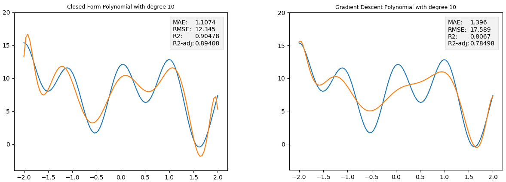

The results are getting better, but there is still a lot of room for improvement. One last try with one billion (**1000000000**) iterations. This time the script has to run overnight, because it takes 7.5 hours to finish on my machine.

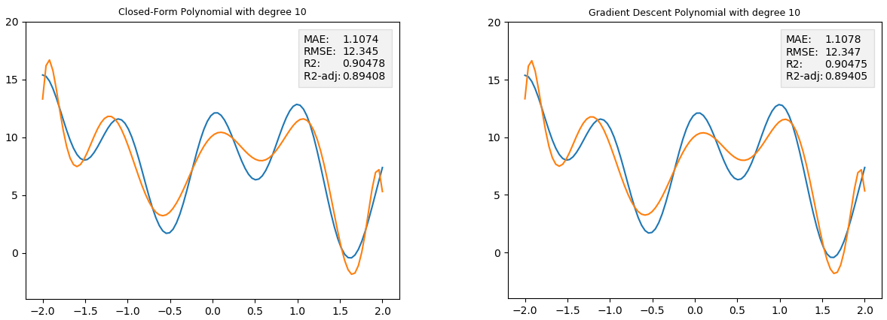

It may have taken a long time, but the results are amazing. We almost replicated the success of our closed-form solution. Given enough time and compute, our algorithm keeps working really well as we increase the complexity of our models.

We have several more degrees to go until we reach our milestone at degree 14. But the amount of time and computational power we had to throw at degree 10 was already quite telling where this journey will lead us. Therefore, I decided that we will take one final stab at the problem, jumping to degree 14 directly.

By doing this, we will find out which quality level we can reach with our Degree 14 solution using gradient descent and a somewhat reasonable resource investment. The script will run over the weekend, as we will bump up the iterations one last time - to 10 billion (**10000000000**) iterations! This final run took 216704 seconds, that's roughly **60 hours**!

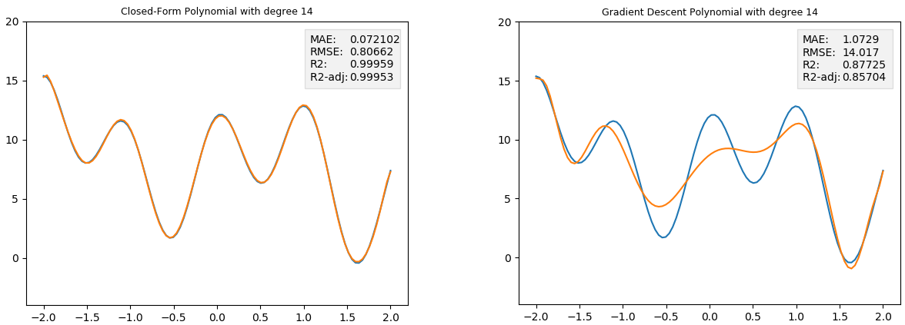

Now that's interesting. Although we invested 60 hours, the result is far from optimal. The less complex model with degree 10 performed better on all 4 metrics although it only ran for 7.5 hours. Of course it would be possible to beat the degree 10 model, but only with an even higher amount of resource investment. If you are trying it out for yourself, let me know how much compute was required to beat the degree 10 model.

Please keep in mind, that this is not an optimized implementation. We ran the script on a single CPU core and didn't throw any specialized hardware onto the problem. Nevertheless, it is impressive to see, how fast the increasing complexity of our polynomial drives up our resource requirements.

## Where to go from here - Next Steps on our Journey

This was a long one, but we are finally done. Gradient descent in theory and practice! I consider it highly important to spend enough time with those fundamentals to really understand what is going on under the hood of neural networks. Taking the theory and applying them to a real machine learning examples like polynomial regression taught me so much more than watching a dozen tutorials. As always, I encourage you to do the same and build your own solutions, experiment and learn from you failures as well as from your successes.

I already gave away in the intro, where we are heading next - Logistic Regression. Now that we understand how to take an arbitrary loss function and apply gradient descent to it, this is the logical next step on our journey.

If you have any questions or spot any errors in this article, don't hesitate to drop me a message on [Twitter](https://twitter.com/Dementophobia).